# Phistory Agent CLI Prompt Surface 演化分析

## 目录

- [0. 读法和结论边界](#section-0)
- [1. 数据集和 capture profile](#section-1)
  - [1.1 capture profile 是什么](#section-1-1)
  - [1.2 数据覆盖](#section-1-2)
- [2. RQ1：不同 Agent CLI 的 OPS 结构有什么异同？](#section-2)
  - [2.1 字段和类别定义](#section-2-1)
    - [Tool text% 与 Tool schema% 的区别](#section-2-1-tool-metrics)
    - [Component 类别及实例](#section-2-1-components)
  - [2.2 最新快照横向结构对比](#section-2-2)
- [3. RQ2：同一个 Agent 的 OPS 如何随时间变化？](#section-3)
  - [3.1 全版本纵向分析](#section-3-1)
  - [3.2 Prompt-size major jump events](#section-3-2)
    - [3.2.1 如何解释这些跳变](#section-3-2-1)
    - [3.2.2 跳变类型概览](#section-3-2-2)
    - [3.2.3 逐个跳变解释](#section-3-2-3)
    - [3.2.4 综合解读](#section-3-2-4)
  - [3.3 Clause-level change event 摘要](#section-3-3)
- [4. RQ3：哪些类别的 prompt 指令变化更活跃？](#section-4)
  - [4.1 分析方法](#section-4-1)
  - [4.2 全历史 clause 类别分布](#section-4-2)
- [5. RQ4：不同 Agent 是否收敛或分化？](#section-5)
- [6. 可直接写进技术报告的方法段](#section-6)
- [7. 仍需加强的地方](#section-7)
- [8. 复现入口和证据文件](#section-8)

<a id="section-0"></a>
## 0. 读法和结论边界

本报告分析当前仓库中的 743 个完整 OPS 快照，覆盖 11 个 Agent CLI。OPS（Observed Prompt Surface）指 Phistory 在特定 capture profile 下捕获到的 prompt-bearing request。它能支持 prompt 文本、工具声明、运行时上下文和版本演化的描述性结论；不能单独证明完整 harness、真实行为、安全性提升或厂商动机。

本次分类状态：model classifier disabled; rule-only labels used。类别分析是规则优先的第一版结果，适合找趋势和候选案例；正式技术报告中应把强结论限定在 `claims.csv` 已记录的证据范围内。

<a id="section-1"></a>
## 1. 数据集和 capture profile

<a id="section-1-1"></a>
### 1.1 capture profile 是什么

这里的 capture profile 指一次 OPS 观测的采集配置，而不是 agent 产品本身。形式上可以写成 `OPS_{agent,version,profile}`。同一个 agent 版本在不同 profile 下可能暴露不同 prompt surface。

本项目中一个 profile 至少包含：

- `tap_client` 和 tap mode，例如 `claude`、`codex`、`opencode`，以及 forward/reverse/auto 模式。
- 实际运行命令，也就是 `meta.json` 里的 `command`，包括 headless/non-interactive 参数、模型参数、权限跳过参数、输出格式参数等。
- 合成用户任务，本仓库通常是 `Reply with one short sentence.`。
- 隔离 HOME、假认证、假 provider/model 配置、临时工作目录、环境变量和 sandbox 信息。
- 具体版本发布时间、捕获时间，以及 `prompt.md` 的规范化规则。

因此，profile 影响的是“这次被观察到的 prompt surface”。例如 headless `exec`/`run` 模式可能和正常交互式 IDE/CLI 模式暴露不同工具或上下文；所以报告里避免说“某 agent 删除了功能”，只说“该 archived profile 下的 OPS 没有暴露某项内容”。

<a id="section-1-2"></a>
### 1.2 数据覆盖

仓库 commit：`9579f1b56aadb10ab7e0c6c1a9296783dbb72b58`；分析时间：2026-07-15 07:48 UTC。
`trace.jsonl` 解析状态：`ok`=668, `missing_body`=75。`missing_body` 多数意味着该 tap client 的 trace 请求体不在统一 `request.body` 位置，相关快照仍保留在文本分析中。

| Agent | Snapshots | First | Last | Distinct capture commands | Static prompt files |
| --- | ---: | --- | --- | ---: | ---: |
| claude-code | 367 | 2025-05-22 | 2026-07-14 | 5 | 32 |
| codex | 68 | 2026-01-09 | 2026-07-14 | 4 | 0 |
| antigravity | 16 | 2026-06-01 | 2026-07-13 | 16 | 0 |
| kimi-code | 44 | 2026-05-22 | 2026-07-14 | 2 | 0 |
| mimo | 5 | 2026-06-15 | 2026-07-07 | 2 | 0 |
| openclaw | 68 | 2026-01-30 | 2026-07-13 | 3 | 0 |
| hermes | 19 | 2026-03-24 | 2026-07-08 | 3 | 0 |
| kimi | 20 | 2026-01-27 | 2026-06-22 | 2 | 0 |
| opencode | 87 | 2026-04-08 | 2026-07-14 | 3 | 0 |
| pi | 30 | 2026-05-07 | 2026-07-14 | 3 | 0 |
| omp | 19 | 2026-07-02 | 2026-07-14 | 1 | 0 |

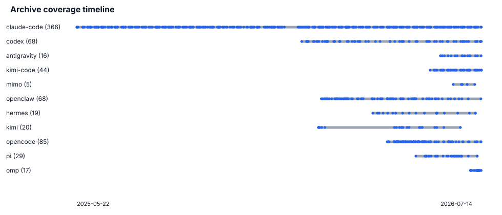

**覆盖图读法：**每一行是一种 Agent；灰线表示当前 archive 覆盖的日历跨度，蓝点表示实际 captured version。它能直观看出 Claude Code 的时间跨度和样本密度远高于近期加入的 OMP、MiMo、Antigravity，因此跨 Agent 汇总必须使用 agent-level macro average，不能把全部版本直接混在一起计数。

下面这张图就是全版本二维时间轴：横轴为版本发布时间，纵轴为 `prompt.md` 字符数；不同 agent 用不同颜色表示，每个圆点对应一个 captured version，折线连接同一 agent 的相邻版本。

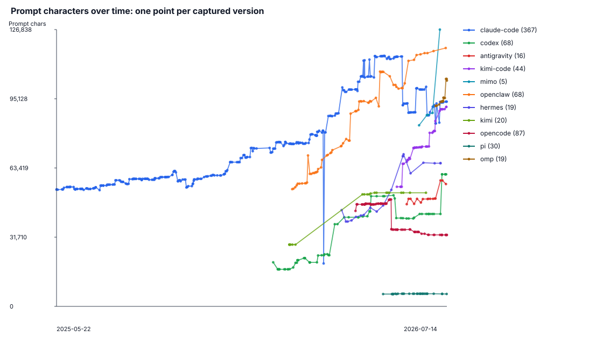
**字符数折线图说明**

**指标口径：**这张二维时间轴的 y 轴使用 `prompt.md` 字符数，因此和 RQ1 的 `Prompt chars` 指标一致。

**最大值：**当前全历史字符数最高的是 `mimo` `0.1.5`（126,838 chars）；最新快照中的字符数最大值是 `mimo` `0.1.5`（126,838 chars）。

**补充检查：**如果需要排查 Markdown/JSON 格式化带来的行数差异，脚本仍会生成 `figures/prompt_lines_timeline.svg`，其纵轴使用 prompt 行数。

**Claude Code `2.1.69` deferred-tool case note：**图中最大相邻负跳变是 `claude-code` `2.1.68` -> `2.1.69`，prompt 字符数从 80,485 降到 19,658（-60,827 chars），观测工具数从 18 降到 1。该快照的 prompt 中出现 `<available-deferred-tools>`，并且 raw trace 只直接暴露 `ToolSearch`。这表示大量工具没有在初始请求里以完整 tool schema 形式 eagerly declared，而是先列出可延迟加载的工具名，再要求模型通过 `ToolSearch` 按需加载具体工具定义。下一版 `2.1.70` 又回到 79,710 chars、18 个观测工具，所以这更像短暂的暴露方式切换，而不是持续收缩。Phistory 对相邻版本使用同一条 capture command 和同一个简单合成任务，因此 `Reply with one short sentence.` 不是充分解释；但这仍然是 *under this archived capture profile* 的观测，不能推出交互模式或真实运行时功能也删除了工具。技术报告中建议写成：`2.1.69` 的初始 OPS 从 eager tool declaration 暂时变成 deferred tool discovery，导致 capability/tool plane 从初始 prompt 中大幅移出。

**opencode `1.15.2` prompt-pruning case note：**`1.15.1` -> `1.15.2` 是图中第二大的非 Claude Code 负跳变之一，prompt 字符数从 48,995 降到 35,358（-13,637 chars）。相邻版本 capture command 相同，instruction/runtime 基本不变，工具集合稳定为 10 个；主要变化是 tool/instruction guidance 文本从 39,507 降到 26,065 chars。最大减少来自这些 section：`Examples of When to Use the Todo List` -4,111 chars; `Committing changes with git` -3,756 chars; `Examples of When NOT to Use the Todo List` -2,178 chars; `Creating pull requests` -1,884 chars；同时新增/合并为更短的 section：`Git and GitHub` +1,824 chars; `Examples` +1,344 chars。下一版 `1.15.3` 保持在 35,358 chars，说明这是持续压缩后的新 plateau。因此它更像是 prompt pruning/compaction：把 Git/GitHub、Task、TodoWrite 等长示例和冗长操作协议压缩成更短规则，而不是 deferred-tool 机制或采集失败。

**为什么 Pi 看起来几乎没变：**在当前 archive 中 Pi 有 30 个快照，发布时间覆盖 2026-05-07 到 2026-07-14。`prompt.md` 字符数只在 5,637–5,784 chars 之间波动，而全图 y 轴最高到 126,838 chars，所以在统一尺度图上接近水平线。首尾字符数从 5,637 到 5,687，净变化 50 chars；工具数一直是 4，参数数一直是 9，schema 字符数只有 1602, 1664 这几个状态。主要可见变化是少量文档路径/读文档规则、`read` 支持格式，以及 `edit` schema 的 `additionalProperties` 字段变化；因此它不是图漏画，而是该 capture profile 下 OPS 本身较小且低 churn。

关键有效性含义：不同 agent 的 command、tap mode、模型/provider 假配置并不一致，所以横向比较要解释为 *under archived capture profiles* 的 OPS 差异。Claude Code 的 `static-prompts.*` 只作为补充材料，不和 runtime OPS 混合。

<a id="section-2"></a>
## 2. RQ1：不同 Agent CLI 的 OPS 结构有什么异同？

<a id="section-2-1"></a>
### 2.1 字段和类别定义

RQ1 的结构表把 prompt surface 拆成几个 plane/component。需要注意：`Instr%`、`Tool text%`、`Runtime%`、`Capture-artifact%` 来自 `prompt.md` 的 section 文本拆分；`Tool schema%` 来自 `trace.jsonl` 的工具 JSON schema，并用 prompt 字符数归一化方便比较。因此 `Tool schema%` 可能和 `Tool text%` 重叠，不能把所有百分比直接相加成 100%。

| Column | Meaning | How computed | Example from this archive |
| --- | --- | --- | --- |
| `Dominant component` | 在 `prompt.md` section 拆分中字符数最大的主成分 | 取 `instruction`、`tool_prompt`、`runtime`、`capture_artifact` 中占比最大者 | [`codex 0.139.0`](../captures/codex/0.139.0/prompt.md) 的 `instruction` 为 20,827/40,670 chars（51.2%），因此 dominant 是 `instruction`；[`hermes v2026.4.16`](../captures/hermes/v2026.4.16/prompt.md) 的 `tool_prompt` 为 39,219/41,880 chars（93.7%），dominant 是 `tool_prompt`。 |
| `Instr%` | 核心自然语言指令占 prompt 字符比例 | identity、workflow、permissions、interaction 等非工具/非运行时 section 字符数 / prompt chars | [`pi 0.80.7`](../captures/pi/0.80.7/prompt.md)：2,449/5,687 chars = 43.1%；也就是该 OPS 约四成是非工具、非运行时的自然语言规则。 |
| `Tool text%` | 工具说明文本占 prompt 字符比例 | `prompt.md` 中 Tools/Tooling/function description 等 section 字符数 / prompt chars | [`claude-code 2.1.210`](../captures/claude-code/2.1.210/prompt.md)：86,194/93,804 chars = 91.9%，说明初始 OPS 绝大部分字符用于工具描述和工具使用指导。 |
| `Tool schema%` | raw request 中工具 JSON schema 的相对规模 | `trace.jsonl` 中 tools 的 schema JSON 字符数 / prompt chars；用于衡量 capability plane 复杂度 | [`openclaw 2026.7.1`](../captures/openclaw/2026.7.1/trace.jsonl)：schema 共 45,544 chars，相当于 prompt.md 字符数的 38.5%。该值来自 raw trace，和 Tool text% 可能重叠。 |
| `Runtime%` | 运行时/环境上下文占 prompt 字符比例 | workspace、OS、shell、sandbox、memory path、session/context 等 section 字符数 / prompt chars | [`kimi 1.48.0`](../captures/kimi/1.48.0/prompt.md)：10,047/52,057 chars = 19.3%，包括 session、workspace 或运行环境相关上下文。 |
| `Capture-artifact%` | 采集工件占 prompt 字符比例 | 合成用户请求、临时路径、日期 ID、Phistory 占位符等明显由 capture 注入的文本 / prompt chars | [`antigravity 1.1.2`](../captures/antigravity/1.1.2/prompt.md)：450/56,057 chars = 0.8%；典型内容包括合成请求 `Reply with one short sentence.` 和采集占位路径。 |
| `Tool count` | 观测到的工具数量；机器字段为 `tool_count` | 优先从 `trace.jsonl` tools 提取，补充从 `prompt.md` Tools section 识别的工具名 | [`openclaw 2026.7.1`](../captures/openclaw/2026.7.1/trace.jsonl) 暴露 38 个工具，是当前各 Agent 最新快照中的最高值。 |
| `Parameter count` | 工具参数总数；机器字段为 `tool_parameter_count` | raw tool schema 的 `properties` 数量总和 | 同一个 [`openclaw 2026.7.1`](../captures/openclaw/2026.7.1/trace.jsonl) 的 38 个工具合计有 435 个参数，其中 34 个为 required；这是参数总数，不是单个工具的参数数。 |
| `Governance notes` | 文本治理显式性提示 | 根据 must/never/confirm/test 等词密度阈值生成，仅表示文本上显式，不表示真实安全性 | [`omp 16.5.2`](../captures/omp/16.5.2/prompt.md) 的 prohibition density 为 18.60/1k words、verification density 为 9.85/1k words，因此标记为 `many prohibitions; verification-heavy`。 |

<a id="section-2-1-tool-metrics"></a>
#### `Tool text%` 与 `Tool schema%` 的区别

这两个指标都描述 capability/tool plane，但观察的是不同表示层。`Tool text%` 衡量面向模型的可读工具文本，包括工具用途、调用时机、限制、示例和工具使用协议；数据来自 `prompt.md` 的 Tools/Tooling sections。`Tool schema%` 衡量工具输入接口的结构化契约，包括参数名、类型、`required`、`enum` 和嵌套对象；数据来自 `trace.jsonl` 原始请求中的 JSON schema。

| Metric | What it captures | Typical growth source |
| --- | --- | --- |
| `Tool text%` | 人类可读的工具描述、规则、示例和操作指导 | 更长的工具说明、更多使用示例、更细的调用策略 |
| `Tool schema%` | 机器可读的输入参数结构和约束 | 更多参数、嵌套对象、枚举、required 字段和参数描述 |

例如，一个文件读取工具在 raw request 中可能表示为：

```json
{
  "name": "read_file",
  "description": "Read a file. Prefer this over shell commands.",
  "input_schema": {
    "type": "object",
    "properties": {
      "path": {"type": "string"},
      "offset": {"type": "integer"}
    },
    "required": ["path"]
  }
}
```

其中，`Tool text` 关注 `Read a file...` 以及 prompt 中附加的使用规则和示例；`Tool schema` 关注 `path`、`offset`、参数类型和 `required` 等结构。于是可能出现三种情况：说明很长但参数很少，即 Tool text 高而 schema 低；说明简短但参数结构复杂，即 schema 高；两者都高，则表示工具接口复杂且附带大量操作指导。

以 [`openclaw 2026.7.1`](../captures/openclaw/2026.7.1/trace.jsonl) 为例，Tool text 为 85,243 chars（72.0%），raw tool schema 为 45,544 chars（相当于 prompt.md 的 38.5%），同时暴露 38 个工具和 435 个参数。这两个百分比不能相加：`prompt.md` 可能已经把 raw schema 渲染进工具章节，因此 schema 内容可能同时落入 Tool text 的 section 统计范围。更准确地说，`Tool text%` 衡量工具面的文本暴露规模，`Tool schema%` 衡量工具输入接口的结构复杂度；它们是可能重叠的两个观察视角，而不是互斥的 prompt 组成部分。

<a id="section-2-1-components"></a>
#### Component 类别及实例

| Component | What belongs here | Concrete archive example | Dominant observed? |
| --- | --- | --- | --- |
| `instruction` | 身份、任务边界、工程流程、权限、交互、验证等自然语言规则 | [`codex 0.139.0`](../captures/codex/0.139.0/prompt.md)：20,827 chars，占 51.2%，是该快照的最大分量。 | 是 |
| `tool_prompt` | 工具名称、用途、调用时机、示例和工具使用协议等 Markdown 文本 | [`hermes v2026.4.16`](../captures/hermes/v2026.4.16/prompt.md)：39,219 chars，占 93.7%。 | 是 |
| `runtime` | workspace、shell、sandbox、日期、session、模型或环境注入 | [`codex 0.80.0`](../captures/codex/0.80.0/prompt.md)：7,058 chars，占 35.0%；该快照中它仍小于 tool text，因此不是 dominant。 | 当前 archive 中否 |
| `capture_artifact` | 合成任务、Phistory 临时路径和其他明确由采集过程产生的内容 | [`claude-code 1.0.0`](../captures/claude-code/1.0.0/prompt.md)：735 chars，占 1.4%，是 archive 中占比较高的例子，但不是 dominant。 | 当前 archive 中否 |
| `tool_schema`（独立 plane） | raw request 中工具参数的 JSON schema；可能与 prompt.md 中已展开的工具文本表达相同能力 | [`openclaw 2026.7.1`](../captures/openclaw/2026.7.1/trace.jsonl)：45,544 schema chars、435 parameters。 | 不参与 dominant 判定 |

因此，`Dominant component` 虽然在方法上允许四种 prompt.md component，但当前 archive 里实际只观察到 `instruction` 和 `tool_prompt` 成为 dominant；`runtime` 与 `capture_artifact` 的示例真实存在，只是从未超过同一快照中的其他分量。`tool_schema` 单独报告为 capability-plane 指标，因为它来自 raw trace，而不一定是 `prompt.md` 的非重叠组成部分。

<a id="section-2-2"></a>
### 2.2 最新快照横向结构对比

最新快照中，prompt 字符数最大的是 `mimo` `0.1.5` （126,838 chars）；观测工具数量最多的是 `openclaw` `2026.7.1`（38 tools）。

| Agent | Version | Prompt chars | Dominant component | Instr% | Tool text% | Tool schema% | Runtime% | Capture-artifact% | Tool count | Parameter count | Governance notes |
| --- | --- | ---: | --- | ---: | ---: | ---: | ---: | ---: | ---: | ---: | --- |
| claude-code | 2.1.210 | 93,804 | tool_prompt | 1.2% | 91.9% | 0.1% | 5.1% | 0.2% | 27 | 0 | many prohibitions |
| codex | 0.144.4 | 60,516 | tool_prompt | 24.2% | 62.9% | 0.0% | 10.8% | 0.8% | 4 | 0 | many prohibitions |
| antigravity | 1.1.2 | 56,057 | tool_prompt | 23.3% | 66.9% | 0.1% | 7.6% | 0.8% | 24 | 0 | - |
| kimi-code | 0.24.1 | 91,392 | tool_prompt | 14.8% | 79.0% | 0.1% | 4.1% | 0.6% | 24 | 0 | many prohibitions |
| mimo | 0.1.5 | 126,838 | tool_prompt | 20.7% | 75.3% | 0.0% | 2.8% | 0.0% | 16 | 0 | - |
| openclaw | 2026.7.1 | 118,397 | tool_prompt | 12.6% | 72.0% | 38.5% | 13.3% | 0.1% | 38 | 435 | - |
| hermes | v2026.7.7.2 | 65,612 | tool_prompt | 2.8% | 88.8% | 0.1% | 7.4% | 0.1% | 29 | 0 | - |
| kimi | 1.48.0 | 52,057 | tool_prompt | 8.1% | 71.1% | 22.2% | 19.3% | 0.1% | 15 | 47 | many prohibitions; verification-heavy |
| opencode | 1.18.1 | 32,734 | tool_prompt | 18.9% | 71.8% | 0.1% | 7.3% | 0.1% | 10 | 0 | verification-heavy; must-heavy |
| pi | 0.80.7 | 5,687 | tool_prompt | 43.1% | 54.8% | 28.2% | 0.0% | 0.5% | 4 | 9 | - |
| omp | 16.5.2 | 103,456 | tool_prompt | 12.4% | 81.6% | 0.0% | 1.8% | 0.0% | 20 | 0 | many prohibitions; verification-heavy |

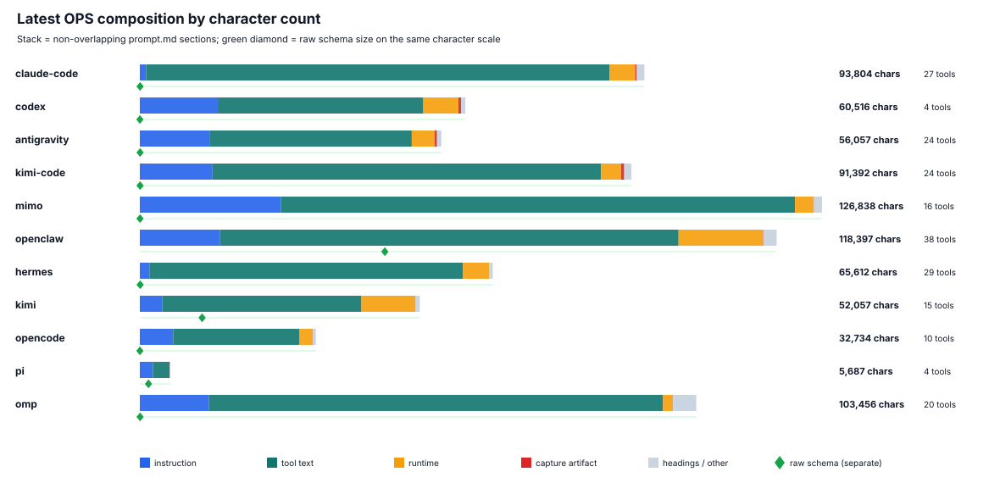

**组成图读法：**横向堆叠条展示最新快照中 instruction、工具说明、runtime 和 capture artifact 的字符组成；它比单看 Prompt chars 更能区分“核心规则增长”和“工具/环境文本增长”。Raw tool schema 是独立证据平面，不能与这些 prompt.md 分量直接相加。

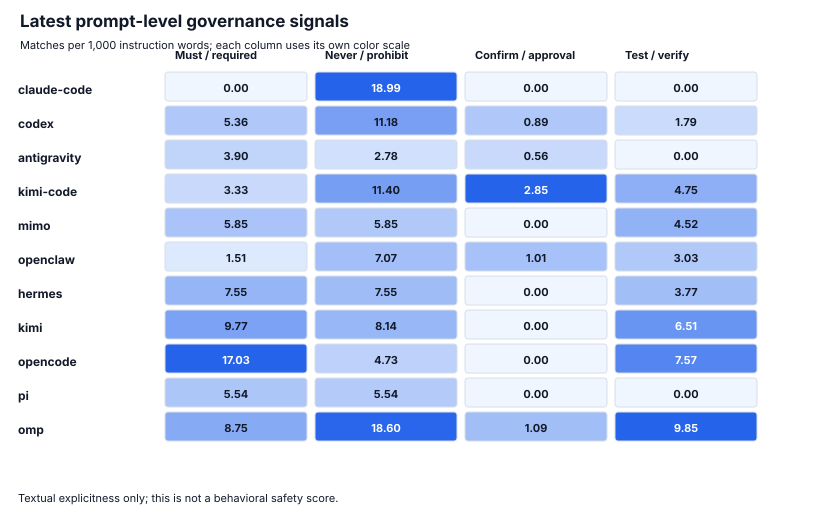

**治理图读法：**四列分别统计 must/required、never/prohibition、confirm/approval、test/verify 在每千个 instruction 单词中的出现密度。颜色在每列内独立归一化，适合观察同一种信号的 Agent 差异；不同列之间不宜直接用颜色深浅比较，更不能解释成安全分数。

可用于技术报告的观察：

- **工具文本/tool-schema-heavy 类型**：多个 agent 的最新 OPS 由工具说明文本主导；OpenClaw 还额外暴露较长 JSON schema，适合讨论 capability plane 如何贡献 prompt surface 规模。
- **文本/运行时-heavy 类型**：MiMo、OpenClaw、OMP 等最新快照中有较大的非核心 instruction 组成，说明仅报告总长度会混淆 instruction、runtime 和 capture artifact。
- **小型低 churn 类型**：Pi 最新快照只有 4 个工具、9 个参数，instruction 与 tool text 都能正常抽取；它适合当作‘版本发布较多但 OPS 设计变化很少’的对照样本。
- **治理指标只表示文本显式性**：must/never/confirm/test 等密度适合比较 prompt-level governance，但不是行为安全分数。

<a id="section-3"></a>
## 3. RQ2：同一个 Agent 的 OPS 如何随时间变化？

<a id="section-3-1"></a>
### 3.1 不是只比较首尾版本

下面的表是首尾变化摘要，用于快速看每个 agent 的长期净变化；真正的纵向分析并不只用首尾两点。管线对每个 agent 的每个 captured version 都生成一行 `longitudinal_metrics.csv`，并在 `prompt_chars_timeline.svg` 中以“一个版本一个点”的方式画出全量时间序列。

- `results/trend_summary.csv`：首尾净变化、epoch 数、最大/平均 churn。
- `results/longitudinal_metrics.csv`：每个版本一个样本点，包含 prompt length、tool count、churn、category churn。
- `figures/prompt_chars_timeline.svg`：横轴时间、纵轴 prompt 字符数、不同 agent 不同颜色、每个版本一个点。
- `figures/prompt_lines_timeline.svg`：补充图，纵轴是 prompt 行数，用于排查 Markdown/JSON 展开格式差异。

按 whole prompt hash 折叠后，平均每个 agent 有 43.8 个 whole-prompt epoch。release 频率和 prompt 设计变化频率明显不是同一个量，因此后续分析应优先以 epoch/change event 为单位。

| Agent | Versions | Prompt delta | Delta% | Instr delta | Schema delta | Tool delta | Whole epochs | Max churn | Mean nonzero churn |
| --- | --- | ---: | ---: | ---: | ---: | ---: | ---: | ---: | ---: |
| claude-code | 1.0.0 -> 2.1.210 | 40,257 | 75.18% | -9,625 | -7,461 | 12 | 271 | 0.807 | 0.016 |
| codex | 0.80.0 -> 0.144.4 | 40,322 | 199.67% | 7,298 | -2,502 | -3 | 32 | 0.760 | 0.072 |
| antigravity | 1.0.4 -> 1.1.2 | 9,242 | 19.74% | 1,847 | 26 | 13 | 11 | 0.076 | 0.022 |
| kimi-code | 0.1.1 -> 0.24.1 | 36,585 | 66.75% | 2,328 | -12,650 | 9 | 20 | 0.105 | 0.019 |
| mimo | 0.1.1 -> 0.1.5 | 43,855 | 52.85% | 15,757 | 4 | 2 | 5 | 0.102 | 0.038 |
| openclaw | 2026.1.29 -> 2026.7.1 | 64,690 | 120.45% | 4,405 | 30,304 | 15 | 68 | 0.126 | 0.023 |
| hermes | v2026.3.23 -> v2026.7.7.2 | 21,499 | 48.74% | -3,690 | -2 | -1 | 18 | 0.115 | 0.036 |
| kimi | 1.0 -> 1.48.0 | 23,762 | 83.98% | -508 | 4,962 | 6 | 5 | 0.311 | 0.082 |
| opencode | 1.4.0 -> 1.18.1 | -11,010 | -25.17% | -3 | 0 | 0 | 31 | 0.196 | 0.020 |
| pi | 0.74.0 -> 0.80.7 | 50 | 0.89% | 117 | -62 | 0 | 7 | 0.019 | 0.006 |
| omp | 16.3.3 -> 16.5.2 | 11,594 | 12.62% | 3,514 | 2 | 1 | 14 | 0.046 | 0.007 |

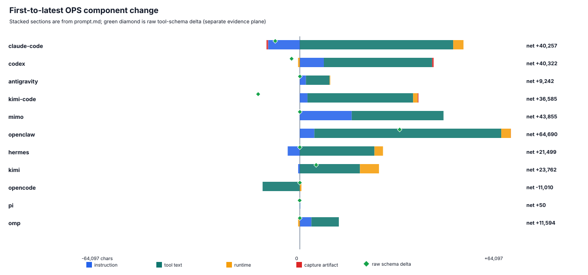

**净变化组成：**堆叠条把首尾 prompt.md section 的变化拆成 instruction、tool text、runtime 和 capture artifact；绿色菱形单独表示 raw tool-schema 变化。右侧 net 数字仍以完整 prompt.md 字符数计算，所以它和堆叠分量可能有少量 heading/格式开销差异。
**首尾分量的定量读法：**10/11 个 Agent 的最大绝对分量变化来自 `tool_prompt_chars`。全历史首尾净收缩的 Agent 为 `opencode` (-11,010 chars)。因此总长度趋势总体由工具说明驱动，但个别 Agent 的收缩和接近不变仍是重要反例。

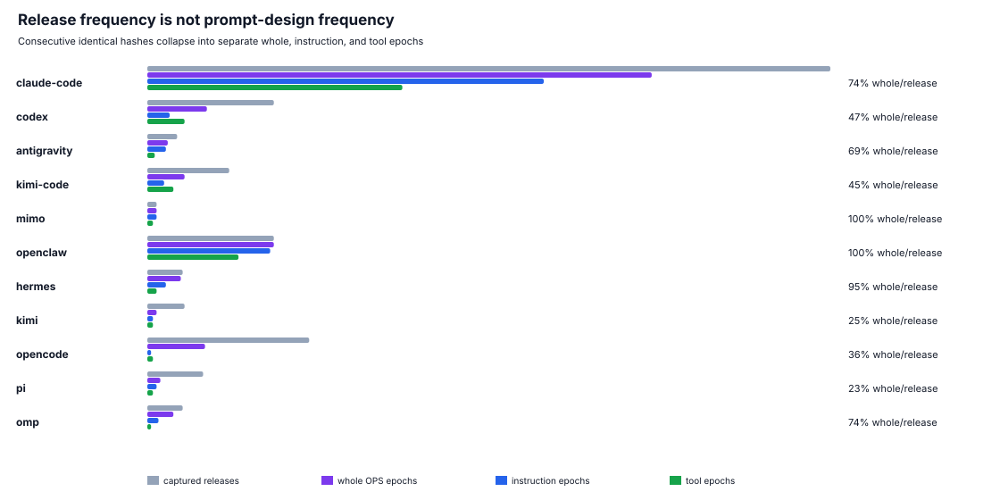

**Release 与 epoch：**灰色是归档版本数，紫/蓝/绿分别是 whole OPS、instruction、tool epoch 数。若 epoch 条明显短于 release 条，说明多个软件版本复用了相同 prompt design；这正是为什么纵向研究不能把每个 release 当成独立设计样本。
**Epoch ratio 的定量读法：**whole-epoch/release 比例最低的是 `pi` 23.3% (7/30)、`kimi` 25.0% (5/20)、`opencode` 35.6% (31/87)；最高的是 `openclaw` 100.0% (68/68)、`mimo` 100.0% (5/5)、`hermes` 94.7% (18/19)。低比例表示 archive 中存在较多 prompt-identical releases；高比例则表示几乎每个 captured release 都形成新的 whole OPS 状态。

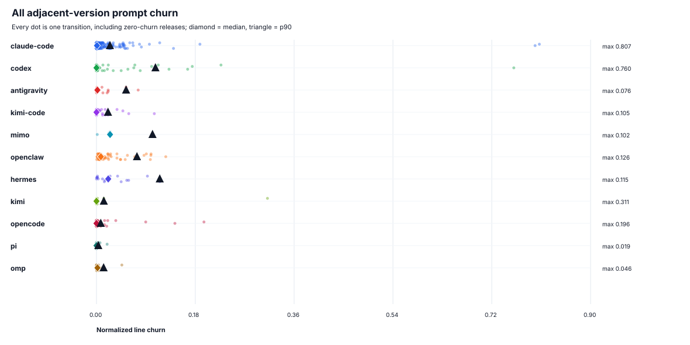

**中间版本没有被省略：**每个点对应一对相邻版本，包括零 churn 版本；菱形是中位数，三角形是 P90，右侧标出最大值。这张图和字符时间线共同回答“变化是否持续发生”：大量点挤在零附近但少数点远离主体，才构成 bursty evolution 的证据。
**Churn 分布的定量读法：**零 churn transition 比例最高的是 `pi` 79.3% (29 transitions)、`kimi` 78.9% (19 transitions)、`opencode` 65.1% (86 transitions)；单次最大 churn 最高的是 `claude-code` 0.807、`codex` 0.760、`kimi` 0.311。这说明‘大量稳定 release + 少数剧烈 redesign’在部分 Agent 上非常明显，但不是所有 Agent 都共享同一种节奏。

<a id="section-3-2"></a>
### 3.2 Prompt-size major jump events

下面这张表系统覆盖字符数折线图里的主要大跳变，按相邻 captured version 的 `abs(prompt_delta_chars)` 排序。完整 Top 30 机器可读表在 `results/major_jump_events.csv`。注意：`days_between` 大的事件可能是 archive 覆盖缺口后的累计变化，不应直接解释成单日改版。

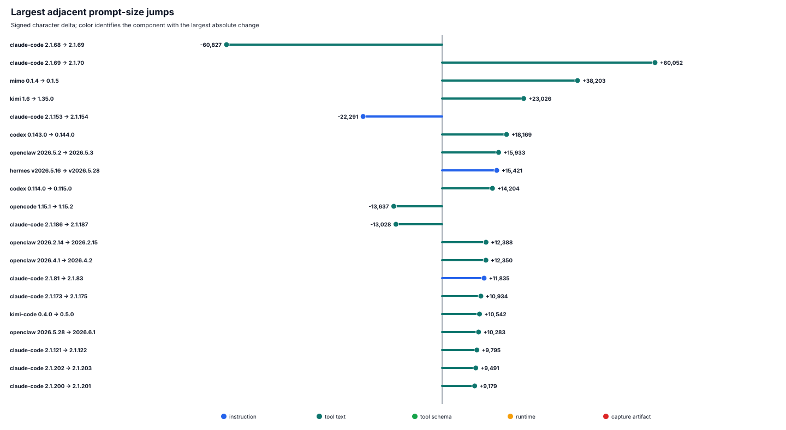

**跳变图读法：**零点左侧是收缩、右侧是增长，线段颜色表示绝对变化最大的 component。它把表中的正负方向和主来源同时编码出来；具体机制仍应以下方 section evidence 和逐事件解释为准。

| Agent | Version transition | Δ chars | Days | Main source | Tool Δ | Same command | Interpretation | Section evidence |
| --- | --- | ---: | ---: | --- | ---: | --- | --- | --- |
| claude-code | 2.1.68 -> 2.1.69 | -60,827 | 0 | tool_text | -17 | true | deferred-tool discovery: initial prompt exposes ToolSearch and defers most tool schemas | removed/shrunk: -8141 Agent; -5907 AskUserQuestion; -4307 Committing changes with git <br> added/expanded: +3649 ToolSearch; +526 User Message; +262 Explicit user requests: |
| claude-code | 2.1.69 -> 2.1.70 | 60,052 | 1 | tool_text | 17 | true | eager tool-surface restored after deferred-tool snapshot | removed/shrunk: -3649 ToolSearch; -218 User Message <br> added/expanded: +6995 Agent; +5995 AskUserQuestion; +4307 Committing changes with git |
| mimo | 0.1.4 -> 0.1.5 | 38,203 | 7 | tool_text | 1 | false | tool/capability surface expansion: more observed tools and longer tool guidance | added/expanded: +15278 Autonomous safety boundaries; +12366 Available Skills; +5744 Discipline |
| kimi | 1.6 -> 1.35.0 | 23,026 | 71 | tool_text | 6 | true | coverage-gap mixed change over 71 days; avoid treating as a single-day redesign | removed/shrunk: -2946 Task <br> added/expanded: +5773 Agent; +2910 AskUserQuestion; +2851 Prompt and Tool Use |
| claude-code | 2.1.153 -> 2.1.154 | -22,291 | 0 | instruction | 1 | true | core instruction pruning or relocation out of initial prompt | removed/shrunk: -7195 Types of memory; -4210 Committing changes with git; -3968 Writing the prompt <br> added/expanded: +17659 Workflow; +2619 Resume; +2272 When to use |
| codex | 0.143.0 -> 0.144.0 | 18,169 | 1 | tool_text | -11 | true | tool-surface reshaping: fewer observed tools but substantially longer tool guidance | removed/shrunk: -5636 Design instructions; -3210 How to use skills; -2359 Available skills <br> added/expanded: +16529 `image_gen__imagegen`; +5793 collaboration; +4880 How to use skills |
| openclaw | 2026.5.2 -> 2026.5.3 | 15,933 | 1 | tool_text | 7 | true | tool/capability surface expansion: more observed tools and longer tool guidance | added/expanded: +7278 browser; +1656 file_write; +1447 dir_fetch |
| hermes | v2026.5.16 -> v2026.5.28 | 15,421 | 12 | instruction | 0 | true | core instruction expansion | removed/shrunk: -699 System Prompt <br> added/expanded: +11760 Skills (mandatory); +2163 session_search; +962 cronjob |
| codex | 0.114.0 -> 0.115.0 | 14,204 | 5 | tool_text | 5 | true | tool/capability surface expansion: more observed tools and longer tool guidance | removed/shrunk: -2213 How to use skills; -625 Available skills; -264 Skills <br> added/expanded: +4811 Parallel delegation patterns; +2955 spawn_agent; +1999 How to use skills |
| opencode | 1.15.1 -> 1.15.2 | -13,637 | 0 | tool_text | 0 | true | prompt pruning/compaction of Git/GitHub, Task, and TodoWrite guidance | removed/shrunk: -4111 Examples of When to Use the Todo List; -3756 Committing changes with git; -2178 Examples of When NOT to Use the Todo List <br> added/expanded: +1824 Git and GitHub; +1344 Examples; +497 When to use |
| claude-code | 2.1.186 -> 2.1.187 | -13,028 | 0 | tool_text | -3 | true | tool/capability surface pruning: fewer observed tools and shorter tool guidance | removed/shrunk: -6018 AskUserQuestion; -1723 When to Use This Tool; -1453 Examples |
| openclaw | 2026.2.14 -> 2026.2.15 | 12,388 | 1 | tool_text | 1 | true | tool/capability surface expansion: more observed tools and longer tool guidance | added/expanded: +10714 message; +428 subagents; +367 Messaging |
| openclaw | 2026.4.1 -> 2026.4.2 | 12,350 | 1 | tool_text | 0 | true | tool guidance expansion/rewrite with stable tool count | removed/shrunk: -36 Tool Call Style <br> added/expanded: +12386 cron |
| claude-code | 2.1.81 -> 2.1.83 | 11,835 | 4 | instruction | 0 | true | core instruction expansion | removed/shrunk: -545 Explicit user requests:; -541 How to save memories:; -309 What NOT to save: <br> added/expanded: +7195 Types of memory; +1204 How to save memories; +1112 Memory and other forms of persistence |
| claude-code | 2.1.173 -> 2.1.175 | 10,934 | 1 | tool_text | 1 | true | tool/capability surface expansion: more observed tools and longer tool guidance | added/expanded: +10917 DesignSync |
| kimi-code | 0.4.0 -> 0.5.0 | 10,542 | 0 | tool_text | 3 | true | tool/capability surface expansion: more observed tools and longer tool guidance | added/expanded: +2909 CronList; +1937 CronDelete; +1023 Returned fields |
| openclaw | 2026.5.28 -> 2026.6.1 | 10,283 | 3 | tool_text | 5 | true | tool/capability surface expansion: more observed tools and longer tool guidance | removed/shrunk: -442 message; -153 sessions_spawn <br> added/expanded: +3205 skill_workshop; +3004 cron; +2109 Skill Workshop |
| claude-code | 2.1.121 -> 2.1.122 | 9,795 | 0 | tool_text | 3 | true | tool/capability surface expansion: more observed tools and longer tool guidance | added/expanded: +6195 Monitor; +1593 PushNotification; +1136 RemoteTrigger |
| claude-code | 2.1.202 -> 2.1.203 | 9,491 | 0 | tool_text | 2 | true | tool/capability surface expansion: more observed tools and longer tool guidance | removed/shrunk: -279 Context management; -80 Runtime behavior <br> added/expanded: +7696 Monitor; +1805 PushNotification; +155 Parameters |
| claude-code | 2.1.200 -> 2.1.201 | 9,179 | 0 | tool_text | 2 | true | tool/capability surface expansion: more observed tools and longer tool guidance | removed/shrunk: -279 Context management; -80 Runtime behavior <br> added/expanded: +7696 Monitor; +1805 PushNotification |

这些大跳变大致分成五类：deferred-tool 暴露方式切换、prompt pruning/compaction、工具/能力面扩张或收缩、核心 instruction 大块增删、以及带覆盖缺口的 mixed change。下面的逐点解释把每个跳变拆成现象、主要来源、section 证据、解释和写作边界，便于后续技术报告直接引用或改写。

<a id="section-3-2-1"></a>
#### 3.2.1 如何解释这些跳变

跳变解释使用四个证据轴，而不是只看折线图高度：

- **规模轴**：`previous_prompt_chars`、`prompt_chars`、`prompt_delta_chars`，说明相邻成功快照之间的总字符变化。
- **分量轴**：instruction、tool text、tool schema、runtime、capture artifact 的 delta，判断变化主要来自核心规则、工具说明、schema 还是运行时注入。
- **结构轴**：工具数量 delta 和 section-level delta，判断是新增/移除工具、重写工具说明，还是压缩长示例。
- **采集轴**：`same_capture_command`、`days_between`、trace parse status，用来区分版本效应、profile 效应和 archive 覆盖缺口。

因此，下面的解释是 prompt-surface 级别的证据解释，不等同于完整 harness 变化。尤其是 `days_between` 很大、`same_capture_command=false` 或 trace body 解析不完整的事件，只能作为弱一些的候选案例。

<a id="section-3-2-2"></a>
#### 3.2.2 跳变类型概览

- **工具/能力面扩张、收缩或重塑**：Top 20 中 13 个事件。
- **核心 instruction epoch 变化**：Top 20 中 3 个事件。
- **deferred-tool / 初始暴露方式切换**：Top 20 中 2 个事件。
- **coverage gap 后的累计 mixed change**：Top 20 中 1 个事件。
- **prompt pruning / compaction**：Top 20 中 1 个事件。

<a id="section-3-2-3"></a>
#### 3.2.3 逐个跳变解释

**J01. `claude-code` `2.1.68` -> `2.1.69`：-60,827 chars (-75.6%)**

- **现象**：`prompt.md` 从 80,485 chars 变为 19,658 chars；观测工具数从 18 变为 1（delta -17）；相邻快照间隔 0 天。
- **主要来源**：最大分量变化是 `tool_text`（工具说明文本 / capability guidance，delta -60,606 chars）。capture command 是否相同：`true`；trace 状态：`ok` -> `ok`。
- **section 证据**：removed/shrunk: -8141 Agent; -5907 AskUserQuestion; -4307 Committing changes with git；added/expanded: +3649 ToolSearch; +526 User Message; +262 Explicit user requests:。证据路径：`captures/claude-code/2.1.68/prompt.md; captures/claude-code/2.1.69/prompt.md`。
- **解释**：解释为 deferred-tool discovery 是因为字符数和工具数同时断崖式下降，且当前 prompt 暴露的是 `ToolSearch` 以及 deferred tools 列表。这类变化的核心不是模型能力突然消失，而是 capability plane 从初始 request 中移到按需检索路径。
- **写作边界**：不能写成工具功能被删除或恢复；只能写成初始 OPS 的工具暴露方式发生变化。

**J02. `claude-code` `2.1.69` -> `2.1.70`：+60,052 chars (+305.5%)**

- **现象**：`prompt.md` 从 19,658 chars 变为 79,710 chars；观测工具数从 1 变为 18（delta +17）；相邻快照间隔 1 天。
- **主要来源**：最大分量变化是 `tool_text`（工具说明文本 / capability guidance，delta +59,260 chars）。capture command 是否相同：`true`；trace 状态：`ok` -> `ok`。
- **section 证据**：removed/shrunk: -3649 ToolSearch; -218 User Message；added/expanded: +6995 Agent; +5995 AskUserQuestion; +4307 Committing changes with git。证据路径：`captures/claude-code/2.1.69/prompt.md; captures/claude-code/2.1.70/prompt.md`。
- **解释**：这是上一条 deferred-tool snapshot 的反向跳变：同一 capture profile 下，大量工具说明和 schema 又回到初始 OPS。因此它更像暴露策略回退/恢复，而不是业务 prompt 在一天内新增了等量自然语言规则。
- **写作边界**：不能写成工具功能被删除或恢复；只能写成初始 OPS 的工具暴露方式发生变化。

**J03. `mimo` `0.1.4` -> `0.1.5`：+38,203 chars (+43.1%)**

- **现象**：`prompt.md` 从 88,635 chars 变为 126,838 chars；观测工具数从 15 变为 16（delta +1）；相邻快照间隔 7 天。
- **主要来源**：最大分量变化是 `tool_text`（工具说明文本 / capability guidance，delta +22,730 chars）。capture command 是否相同：`false`；trace 状态：`ok` -> `ok`。
- **section 证据**：added/expanded: +15278 Autonomous safety boundaries; +12366 Available Skills; +5744 Discipline。证据路径：`captures/mimo/0.1.4/prompt.md; captures/mimo/0.1.5/prompt.md`。
- **解释**：主要来源是 工具说明文本 / capability guidance 增长，并伴随观测工具数增加 1。这通常表示新工具、新能力模块或更完整的工具说明进入初始 OPS。
- **写作边界**：由于 capture command 不同，技术报告里要把它标成 profile-sensitive 证据。

**J04. `kimi` `1.6` -> `1.35.0`：+23,026 chars (+81.4%)**

- **现象**：`prompt.md` 从 28,295 chars 变为 51,321 chars；观测工具数从 9 变为 15（delta +6）；相邻快照间隔 71 天。
- **主要来源**：最大分量变化是 `tool_text`（工具说明文本 / capability guidance，delta +17,539 chars）。capture command 是否相同：`true`；trace 状态：`ok` -> `ok`。
- **section 证据**：removed/shrunk: -2946 Task；added/expanded: +5773 Agent; +2910 AskUserQuestion; +2851 Prompt and Tool Use。证据路径：`captures/kimi/1.6/prompt.md; captures/kimi/1.35.0/prompt.md`。
- **解释**：该相邻快照之间隔了 71 天，archive 中缺少中间成功样本；因此这一行只能说明两个被捕获端点之间发生了累计差异，不能定位到某一个 upstream release 或某一天的设计决策。
- **写作边界**：需要回填中间版本或查 upstream release notes，才能把变化归因到更细的版本窗口。

**J05. `claude-code` `2.1.153` -> `2.1.154`：-22,291 chars (-19.5%)**

- **现象**：`prompt.md` 从 114,487 chars 变为 92,196 chars；观测工具数从 28 变为 29（delta +1）；相邻快照间隔 0 天。
- **主要来源**：最大分量变化是 `instruction`（核心 instruction / 自然语言规则，delta -21,983 chars）。capture command 是否相同：`true`；trace 状态：`ok` -> `ok`。
- **section 证据**：removed/shrunk: -7195 Types of memory; -4210 Committing changes with git; -3968 Writing the prompt；added/expanded: +17659 Workflow; +2619 Resume; +2272 When to use。证据路径：`captures/claude-code/2.1.153/prompt.md; captures/claude-code/2.1.154/prompt.md`。
- **解释**：主要来源是 核心 instruction / 自然语言规则 缩短，可能是自然语言规则被合并、移动到工具说明/运行时模板，或从初始 OPS 中裁剪。
- **写作边界**：相邻 capture profile 基本一致，因此可作为较强的文本变化证据；但仍不能推出真实任务表现或安全性变化。

**J06. `codex` `0.143.0` -> `0.144.0`：+18,169 chars (+42.9%)**

- **现象**：`prompt.md` 从 42,347 chars 变为 60,516 chars；观测工具数从 15 变为 4（delta -11）；相邻快照间隔 1 天。
- **主要来源**：最大分量变化是 `tool_text`（工具说明文本 / capability guidance，delta +24,348 chars）。capture command 是否相同：`true`；trace 状态：`missing_body` -> `missing_body`。
- **section 证据**：removed/shrunk: -5636 Design instructions; -3210 How to use skills; -2359 Available skills；added/expanded: +16529 `image_gen__imagegen`; +5793 collaboration; +4880 How to use skills。证据路径：`captures/codex/0.143.0/prompt.md; captures/codex/0.144.0/prompt.md`。
- **解释**：这是工具面重塑而不是简单扩张：观测工具数减少，但保留下来的工具说明、技能说明或单个工具文档显著变长。报告中应强调 component composition，而不是只看工具数量。
- **写作边界**：raw trace body 未按统一格式解析，工具/schema 统计更多依赖 prompt.md 文本抽取；应避免过度解释 schema 细节。

**J07. `openclaw` `2026.5.2` -> `2026.5.3`：+15,933 chars (+17.4%)**

- **现象**：`prompt.md` 从 91,638 chars 变为 107,571 chars；观测工具数从 25 变为 32（delta +7）；相邻快照间隔 1 天。
- **主要来源**：最大分量变化是 `tool_text`（工具说明文本 / capability guidance，delta +15,335 chars）。capture command 是否相同：`true`；trace 状态：`ok` -> `ok`。
- **section 证据**：added/expanded: +7278 browser; +1656 file_write; +1447 dir_fetch。证据路径：`captures/openclaw/2026.5.2/prompt.md; captures/openclaw/2026.5.3/prompt.md`。
- **解释**：主要来源是 工具说明文本 / capability guidance 增长，并伴随观测工具数增加 7。这通常表示新工具、新能力模块或更完整的工具说明进入初始 OPS。
- **写作边界**：相邻 capture profile 基本一致，因此可作为较强的文本变化证据；但仍不能推出真实任务表现或安全性变化。

**J08. `hermes` `v2026.5.16` -> `v2026.5.28`：+15,421 chars (+28.9%)**

- **现象**：`prompt.md` 从 53,390 chars 变为 68,811 chars；观测工具数从 28 变为 28（delta +0）；相邻快照间隔 12 天。
- **主要来源**：最大分量变化是 `instruction`（核心 instruction / 自然语言规则，delta +11,061 chars）。capture command 是否相同：`true`；trace 状态：`missing_body` -> `missing_body`。
- **section 证据**：removed/shrunk: -699 System Prompt；added/expanded: +11760 Skills (mandatory); +2163 session_search; +962 cronjob。证据路径：`captures/hermes/v2026.5.16/prompt.md; captures/hermes/v2026.5.28/prompt.md`。
- **解释**：主要来源是 核心 instruction / 自然语言规则 扩张，通常意味着任务生命周期、记忆、验证、工作流或交互规则被更显式地写进 OPS。
- **写作边界**：raw trace body 未按统一格式解析，工具/schema 统计更多依赖 prompt.md 文本抽取；应避免过度解释 schema 细节。

**J09. `codex` `0.114.0` -> `0.115.0`：+14,204 chars (+60.6%)**

- **现象**：`prompt.md` 从 23,453 chars 变为 37,657 chars；观测工具数从 7 变为 12（delta +5）；相邻快照间隔 5 天。
- **主要来源**：最大分量变化是 `tool_text`（工具说明文本 / capability guidance，delta +13,536 chars）。capture command 是否相同：`true`；trace 状态：`ok` -> `ok`。
- **section 证据**：removed/shrunk: -2213 How to use skills; -625 Available skills; -264 Skills；added/expanded: +4811 Parallel delegation patterns; +2955 spawn_agent; +1999 How to use skills。证据路径：`captures/codex/0.114.0/prompt.md; captures/codex/0.115.0/prompt.md`。
- **解释**：主要来源是 工具说明文本 / capability guidance 增长，并伴随观测工具数增加 5。这通常表示新工具、新能力模块或更完整的工具说明进入初始 OPS。
- **写作边界**：相邻 capture profile 基本一致，因此可作为较强的文本变化证据；但仍不能推出真实任务表现或安全性变化。

**J10. `opencode` `1.15.1` -> `1.15.2`：-13,637 chars (-27.8%)**

- **现象**：`prompt.md` 从 48,995 chars 变为 35,358 chars；观测工具数从 10 变为 10（delta +0）；相邻快照间隔 0 天。
- **主要来源**：最大分量变化是 `tool_text`（工具说明文本 / capability guidance，delta -13,442 chars）。capture command 是否相同：`true`；trace 状态：`ok` -> `ok`。
- **section 证据**：removed/shrunk: -4111 Examples of When to Use the Todo List; -3756 Committing changes with git; -2178 Examples of When NOT to Use the Todo List；added/expanded: +1824 Git and GitHub; +1344 Examples; +497 When to use。证据路径：`captures/opencode/1.15.1/prompt.md; captures/opencode/1.15.2/prompt.md`。
- **解释**：该事件的特征是工具数量不变或基本不变，但工具/工作流说明文本明显缩短，并且减少集中在长示例、Git/GitHub 操作协议、Todo/Task 使用示例等可压缩说明上。这更像把冗长教程式 prompt 改写成较短的规则集合。
- **写作边界**：相邻 capture profile 基本一致，因此可作为较强的文本变化证据；但仍不能推出真实任务表现或安全性变化。

**J11. `claude-code` `2.1.186` -> `2.1.187`：-13,028 chars (-13.0%)**

- **现象**：`prompt.md` 从 100,599 chars 变为 87,571 chars；观测工具数从 29 变为 26（delta -3）；相邻快照间隔 0 天。
- **主要来源**：最大分量变化是 `tool_text`（工具说明文本 / capability guidance，delta -12,654 chars）。capture command 是否相同：`true`；trace 状态：`ok` -> `ok`。
- **section 证据**：removed/shrunk: -6018 AskUserQuestion; -1723 When to Use This Tool; -1453 Examples。证据路径：`captures/claude-code/2.1.186/prompt.md; captures/claude-code/2.1.187/prompt.md`。
- **解释**：主要来源是 工具说明文本 / capability guidance 缩短，并伴随观测工具数减少 3。这通常表示部分工具未再被初始请求暴露，或相关工具说明被移出/合并/裁剪。
- **写作边界**：相邻 capture profile 基本一致，因此可作为较强的文本变化证据；但仍不能推出真实任务表现或安全性变化。

**J12. `openclaw` `2026.2.14` -> `2026.2.15`：+12,388 chars (+21.8%)**

- **现象**：`prompt.md` 从 56,773 chars 变为 69,161 chars；观测工具数从 23 变为 24（delta +1）；相邻快照间隔 1 天。
- **主要来源**：最大分量变化是 `tool_text`（工具说明文本 / capability guidance，delta +11,707 chars）。capture command 是否相同：`true`；trace 状态：`ok` -> `ok`。
- **section 证据**：added/expanded: +10714 message; +428 subagents; +367 Messaging。证据路径：`captures/openclaw/2026.2.14/prompt.md; captures/openclaw/2026.2.15/prompt.md`。
- **解释**：主要来源是 工具说明文本 / capability guidance 增长，并伴随观测工具数增加 1。这通常表示新工具、新能力模块或更完整的工具说明进入初始 OPS。
- **写作边界**：相邻 capture profile 基本一致，因此可作为较强的文本变化证据；但仍不能推出真实任务表现或安全性变化。

**J13. `openclaw` `2026.4.1` -> `2026.4.2`：+12,350 chars (+16.3%)**

- **现象**：`prompt.md` 从 75,958 chars 变为 88,308 chars；观测工具数从 27 变为 27（delta +0）；相邻快照间隔 1 天。
- **主要来源**：最大分量变化是 `tool_text`（工具说明文本 / capability guidance，delta +12,386 chars）。capture command 是否相同：`true`；trace 状态：`ok` -> `ok`。
- **section 证据**：removed/shrunk: -36 Tool Call Style；added/expanded: +12386 cron。证据路径：`captures/openclaw/2026.4.1/prompt.md; captures/openclaw/2026.4.2/prompt.md`。
- **解释**：工具数量稳定但工具说明文本发生大幅变化，说明变化集中在工具使用协议、示例、参数解释或技能文档的重写。这类事件容易被总长度图看成能力变化，但更准确地说是 capability guidance 的表达方式变化。
- **写作边界**：相邻 capture profile 基本一致，因此可作为较强的文本变化证据；但仍不能推出真实任务表现或安全性变化。

**J14. `claude-code` `2.1.81` -> `2.1.83`：+11,835 chars (+13.4%)**

- **现象**：`prompt.md` 从 88,496 chars 变为 100,331 chars；观测工具数从 22 变为 22（delta +0）；相邻快照间隔 4 天。
- **主要来源**：最大分量变化是 `instruction`（核心 instruction / 自然语言规则，delta +9,340 chars）。capture command 是否相同：`true`；trace 状态：`ok` -> `ok`。
- **section 证据**：removed/shrunk: -545 Explicit user requests:; -541 How to save memories:; -309 What NOT to save:；added/expanded: +7195 Types of memory; +1204 How to save memories; +1112 Memory and other forms of persistence。证据路径：`captures/claude-code/2.1.81/prompt.md; captures/claude-code/2.1.83/prompt.md`。
- **解释**：主要来源是 核心 instruction / 自然语言规则 扩张，通常意味着任务生命周期、记忆、验证、工作流或交互规则被更显式地写进 OPS。
- **写作边界**：相邻 capture profile 基本一致，因此可作为较强的文本变化证据；但仍不能推出真实任务表现或安全性变化。

**J15. `claude-code` `2.1.173` -> `2.1.175`：+10,934 chars (+12.3%)**

- **现象**：`prompt.md` 从 88,946 chars 变为 99,880 chars；观测工具数从 27 变为 28（delta +1）；相邻快照间隔 1 天。
- **主要来源**：最大分量变化是 `tool_text`（工具说明文本 / capability guidance，delta +10,917 chars）。capture command 是否相同：`true`；trace 状态：`ok` -> `ok`。
- **section 证据**：added/expanded: +10917 DesignSync。证据路径：`captures/claude-code/2.1.173/prompt.md; captures/claude-code/2.1.175/prompt.md`。
- **解释**：主要来源是 工具说明文本 / capability guidance 增长，并伴随观测工具数增加 1。这通常表示新工具、新能力模块或更完整的工具说明进入初始 OPS。
- **写作边界**：相邻 capture profile 基本一致，因此可作为较强的文本变化证据；但仍不能推出真实任务表现或安全性变化。

**J16. `kimi-code` `0.4.0` -> `0.5.0`：+10,542 chars (+19.2%)**

- **现象**：`prompt.md` 从 54,807 chars 变为 65,349 chars；观测工具数从 15 变为 18（delta +3）；相邻快照间隔 0 天。
- **主要来源**：最大分量变化是 `tool_text`（工具说明文本 / capability guidance，delta +10,123 chars）。capture command 是否相同：`true`；trace 状态：`ok` -> `ok`。
- **section 证据**：added/expanded: +2909 CronList; +1937 CronDelete; +1023 Returned fields。证据路径：`captures/kimi-code/0.4.0/prompt.md; captures/kimi-code/0.5.0/prompt.md`。
- **解释**：主要来源是 工具说明文本 / capability guidance 增长，并伴随观测工具数增加 3。这通常表示新工具、新能力模块或更完整的工具说明进入初始 OPS。
- **写作边界**：相邻 capture profile 基本一致，因此可作为较强的文本变化证据；但仍不能推出真实任务表现或安全性变化。

**J17. `openclaw` `2026.5.28` -> `2026.6.1`：+10,283 chars (+10.1%)**

- **现象**：`prompt.md` 从 102,217 chars 变为 112,500 chars；观测工具数从 32 变为 37（delta +5）；相邻快照间隔 3 天。
- **主要来源**：最大分量变化是 `tool_text`（工具说明文本 / capability guidance，delta +7,733 chars）。capture command 是否相同：`true`；trace 状态：`ok` -> `ok`。
- **section 证据**：removed/shrunk: -442 message; -153 sessions_spawn；added/expanded: +3205 skill_workshop; +3004 cron; +2109 Skill Workshop。证据路径：`captures/openclaw/2026.5.28/prompt.md; captures/openclaw/2026.6.1/prompt.md`。
- **解释**：主要来源是 工具说明文本 / capability guidance 增长，并伴随观测工具数增加 5。这通常表示新工具、新能力模块或更完整的工具说明进入初始 OPS。
- **写作边界**：相邻 capture profile 基本一致，因此可作为较强的文本变化证据；但仍不能推出真实任务表现或安全性变化。

**J18. `claude-code` `2.1.121` -> `2.1.122`：+9,795 chars (+9.3%)**

- **现象**：`prompt.md` 从 104,891 chars 变为 114,686 chars；观测工具数从 23 变为 26（delta +3）；相邻快照间隔 0 天。
- **主要来源**：最大分量变化是 `tool_text`（工具说明文本 / capability guidance，delta +8,924 chars）。capture command 是否相同：`true`；trace 状态：`ok` -> `ok`。
- **section 证据**：added/expanded: +6195 Monitor; +1593 PushNotification; +1136 RemoteTrigger。证据路径：`captures/claude-code/2.1.121/prompt.md; captures/claude-code/2.1.122/prompt.md`。
- **解释**：主要来源是 工具说明文本 / capability guidance 增长，并伴随观测工具数增加 3。这通常表示新工具、新能力模块或更完整的工具说明进入初始 OPS。
- **写作边界**：相邻 capture profile 基本一致，因此可作为较强的文本变化证据；但仍不能推出真实任务表现或安全性变化。

**J19. `claude-code` `2.1.202` -> `2.1.203`：+9,491 chars (+11.3%)**

- **现象**：`prompt.md` 从 84,181 chars 变为 93,672 chars；观测工具数从 25 变为 27（delta +2）；相邻快照间隔 0 天。
- **主要来源**：最大分量变化是 `tool_text`（工具说明文本 / capability guidance，delta +9,733 chars）。capture command 是否相同：`true`；trace 状态：`ok` -> `ok`。
- **section 证据**：removed/shrunk: -279 Context management; -80 Runtime behavior；added/expanded: +7696 Monitor; +1805 PushNotification; +155 Parameters。证据路径：`captures/claude-code/2.1.202/prompt.md; captures/claude-code/2.1.203/prompt.md`。
- **解释**：主要来源是 工具说明文本 / capability guidance 增长，并伴随观测工具数增加 2。这通常表示新工具、新能力模块或更完整的工具说明进入初始 OPS。
- **写作边界**：相邻 capture profile 基本一致，因此可作为较强的文本变化证据；但仍不能推出真实任务表现或安全性变化。

**J20. `claude-code` `2.1.200` -> `2.1.201`：+9,179 chars (+10.9%)**

- **现象**：`prompt.md` 从 83,828 chars 变为 93,007 chars；观测工具数从 25 变为 27（delta +2）；相邻快照间隔 0 天。
- **主要来源**：最大分量变化是 `tool_text`（工具说明文本 / capability guidance，delta +9,421 chars）。capture command 是否相同：`true`；trace 状态：`ok` -> `ok`。
- **section 证据**：removed/shrunk: -279 Context management; -80 Runtime behavior；added/expanded: +7696 Monitor; +1805 PushNotification。证据路径：`captures/claude-code/2.1.200/prompt.md; captures/claude-code/2.1.201/prompt.md`。
- **解释**：主要来源是 工具说明文本 / capability guidance 增长，并伴随观测工具数增加 2。这通常表示新工具、新能力模块或更完整的工具说明进入初始 OPS。
- **写作边界**：相邻 capture profile 基本一致，因此可作为较强的文本变化证据；但仍不能推出真实任务表现或安全性变化。

<a id="section-3-2-4"></a>
#### 3.2.4 综合解读

Top 20 大跳变中，正向增长有 16 个，负向收缩有 4 个；最大分量为 `tool_text` 的有 17 个，最大分量为 `instruction` 的有 3 个。这说明折线图里的尖峰多数不是单纯核心角色说明变长，而是 capability/tool plane 的暴露、说明、裁剪或重写。
有 1 个事件的 `same_capture_command=false`，有 1 个事件存在 30 天以上的 archive 覆盖缺口，有 2 个事件的 raw trace body 未按统一格式解析。技术报告中可以把这些作为 evidence strength 分层：同命令、短间隔、trace ok 的事件证据最强；profile 变化、覆盖缺口和 missing body 的事件需要更保守。
Claude Code 的多个跳变反复涉及 `Monitor`、`PushNotification`、`RemoteTrigger` 等工具说明（例如 `claude-code 2.1.121->2.1.122`, `claude-code 2.1.202->2.1.203`, `claude-code 2.1.200->2.1.201`）。这类重复出现的正负跳变更像某些 capability 模块在初始 OPS 中被暴露、隐藏或重新暴露，而不是 prompt 总体线性增长。写作时可以把它作为“工具面模块化/条件暴露导致局部震荡”的案例。
profile-sensitive 事件包括 `mimo 0.1.4->0.1.5`。这些事件仍然有文本事实价值，但不能只用版本号解释，因为 run command、模型/provider 配置或 tap 方式变化可能同时影响 OPS。
覆盖缺口事件包括 `kimi 1.6->1.35.0` (71 days)。它们适合描述为“两个观测端点之间的累计变化”，不适合描述为一次明确 redesign，除非后续补采中间版本或找到外部 release note。
整体上，跳变分析支持一种更细的写法：prompt surface 的演化不是简单的‘越来越长’，而是由几种机制叠加产生：工具 schema/工具说明进入或离开初始请求、长示例被压缩、核心工作流/记忆/技能规则成块重写、以及 capture profile 暴露策略变化。后续技术报告应把这些机制分别讨论，而不要把所有尖峰都归因于同一种趋势。


<a id="section-3-3"></a>
### 3.3 全版本 clause-level change event 摘要

最大相邻 clause churn 事件如下。它们用于挑选 case study，而不是自动等同 prompt-size 最大变化：

| Agent | Version | Churn | Added | Removed | Moved | Dominant churn categories |
| --- | --- | ---: | ---: | ---: | ---: | --- |
| claude-code | 2.1.69 | 0.807 | 5 | 1 | 11 | SE Workflow:2; Uncertain:2; Memory:1 |
| claude-code | 2.1.70 | 0.799 | 1 | 2 | 5 | Uncertain:2; Extensibility:1 |
| codex | 0.144.0 | 0.760 | 118 | 162 | 39 | Uncertain:73; Runtime/Capture:69; Interaction/Output:46 |
| kimi | 1.35.0 | 0.311 | 52 | 11 | 62 | Runtime/Capture:43; Interaction/Output:4; Extensibility:4 |
| codex | 0.115.0 | 0.227 | 3 | 1 | 18 | Extensibility:2; Runtime/Capture:2 |
| opencode | 1.15.2 | 0.196 | 0 | 0 | 0 |  |
| claude-code | 2.1.154 | 0.188 | 26 | 169 | 10 | Memory:57; Runtime/Capture:57; Uncertain:19 |
| codex | 0.133.0 | 0.174 | 1 | 1 | 0 | Runtime/Capture:2 |
| codex | 0.96.0 | 0.166 | 0 | 0 | 0 |  |
| opencode | 1.17.8 | 0.143 | 1 | 1 | 0 | Runtime/Capture:2 |

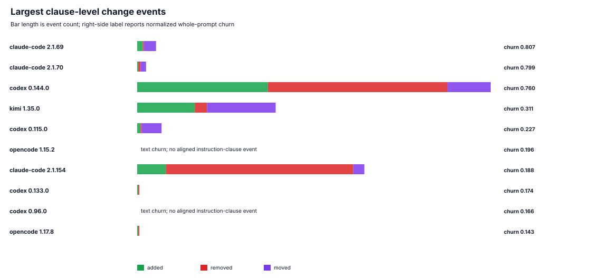

**Clause event 图读法：**绿色、红色、紫色分别表示 add、remove、move 数量，右侧保留 normalized whole-prompt churn。条形为空但 churn 非零时，通常意味着变化发生在工具文本/schema，或未进入当前 instruction/runtime clause 对齐范围；这正好提醒读者不要把两个指标混为一谈。

初步解释：Claude Code 早期和 Codex 近期都有较高 churn 事件，但需要逐条查看 `change_events.csv` 区分真实内容变更、段落重排、工具 schema 重排和 capture profile 变化。`moved_clauses` 较高的事件尤其不应被简单解释为删除/新增。

<a id="section-4"></a>
## 4. RQ3：哪些类别的 prompt 指令变化更活跃？

<a id="section-4-1"></a>
### 4.1 这个结果是怎么分析出来的

RQ3 的输入不是人工印象，而是脚本生成的 clause 表和相邻版本 diff：

1. 先把每个 `prompt.md` 按 Markdown heading 切成 section，并用 heading/content 规则标记 component type：`instruction`、`tool`、`runtime`、`capture_artifact`。
2. 对 `instruction` 和 `runtime` section 做 clause segmentation：优先按 bullet/numbered list 切分，长段落再按句子边界切分；代码块跳过。
3. 每条 clause 做轻量 normalization：替换日期、UUID、Phistory 占位符、合成任务等 volatile artifact，生成 `normalized_hash`。
4. 用 heading + clause 文本的高精度关键词规则打一个 primary category。例如 `confirm/delete/approval` 归入 permissions，`test/verify/evidence` 归入 reliability，`memory/context/session` 归入 memory。规则未覆盖的标记为 `uncertain`。
5. 对相邻版本比较 clause hash 集合：新 hash 记为 `add`，旧 hash 消失记为 `remove`，hash 相同但位置变化记为 `move`。类别 churn 主要来自 add/remove 的类别计数。
6. 汇总到 `category_summary.csv`、`change_events.csv`、`longitudinal_metrics.csv` 和 `change_heatmap.svg`。

因此，RQ3 表里“Top categories”回答的是全历史文本分布；`change_heatmap.svg` 和 `top_change_events.csv` 才更接近“变化更活跃”的问题。由于当前分类是 rule-only，`uncertain` 高的 agent 需要人工或经批准的模型分类复核。

<a id="section-4-2"></a>
### 4.2 全历史 clause 类别分布

| Agent | Top categories | Uncertain share | Runtime/capture share |
| --- | --- | ---: | ---: |
| claude-code | Runtime/Capture 17.9%; SE Workflow 14.0%; Uncertain 12.5% | 12.5% | 17.9% |
| codex | Runtime/Capture 24.3%; Uncertain 22.1%; Interaction/Output 17.9% | 22.1% | 24.3% |
| antigravity | Uncertain 29.3%; Runtime/Capture 25.1%; Reliability 23.2% | 29.3% | 25.1% |
| kimi-code | Uncertain 19.5%; Runtime/Capture 18.3%; Extensibility 14.7% | 19.5% | 18.3% |
| mimo | Runtime/Capture 26.3%; Memory 24.2%; Uncertain 12.7% | 12.7% | 26.3% |
| openclaw | Runtime/Capture 65.2%; Uncertain 11.4%; Extensibility 6.0% | 11.4% | 65.2% |
| hermes | Extensibility 40.8%; Runtime/Capture 20.6%; Uncertain 11.3% | 11.3% | 20.6% |
| kimi | Runtime/Capture 64.4%; Extensibility 15.2%; Uncertain 7.2% | 7.2% | 64.4% |
| opencode | Runtime/Capture 28.8%; Uncertain 18.4%; Planning 17.1% | 18.4% | 28.8% |
| pi | Uncertain 42.1%; Runtime/Capture 16.8%; SE Workflow 12.6% | 42.1% | 16.8% |
| omp | Uncertain 31.3%; Reliability 16.8%; Runtime/Capture 15.7% | 31.3% | 15.7% |

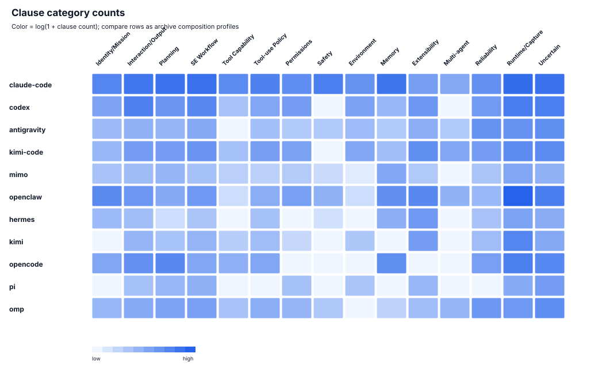

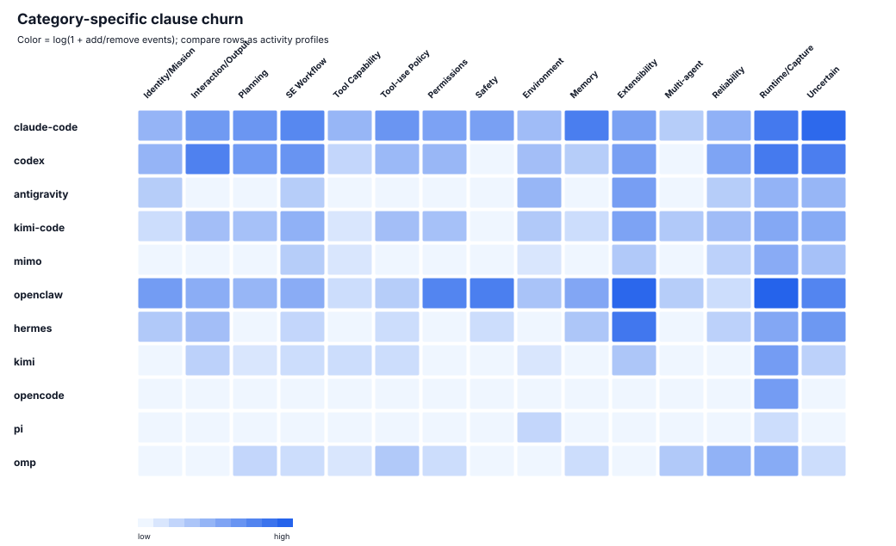

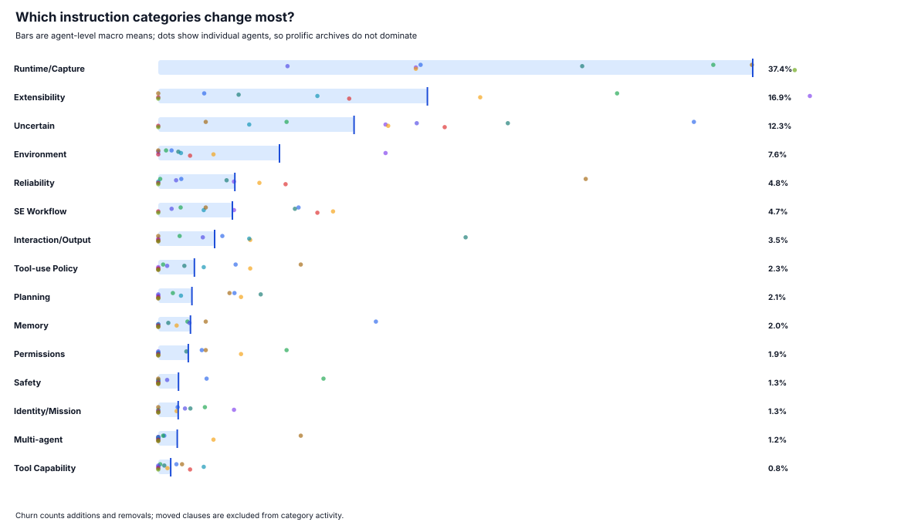

**类别图的三种口径：**第一张是全历史 clause 数量，回答“archive 中写了什么”；第二张是 Agent × category 的 add/remove 活动量，回答“哪里发生过变化”；第三张先在每个 Agent 内归一化，再做 macro-average，降低 Claude Code 等高频 archive 对总量的支配。第三张的蓝条是跨 Agent 平均，散点显示 Agent 间异质性；Runtime/Capture 和 Uncertain 较高时应优先视作分类与采集敏感性信号。
**类别活跃度的定量读法：**agent-level macro-average 排名前四的是 `Runtime/Capture` 37.4%、`Extensibility` 16.9%、`Uncertain` 12.3%、`Environment` 7.6%。其中 Runtime/Capture 和 Uncertain 不宜被当作产品能力趋势；排除这两类后，最高的实质类别可作为后续人工复核和 case study 的优先入口。

可检验趋势假设的当前状态：

| Hypothesis | Current evidence status | How to use it |
| --- | --- | --- |
| H1: 总长度增长主要来自工具 schema | 部分支持但 agent-specific；OpenClaw/Kimi 的 schema 增量明显，MiMo/OMP 的总长度还受 runtime/capture 文本影响 | 在报告中拆分 plane，避免只讲总长度 |
| H2: 变化是 bursty 的 | 支持作为候选：top churn 集中在少数版本 | 用 top change events 做 case studies |
| H3: 权限/确认/验证规则更显式 | 需要更强分类验证；当前只能用 governance density 做候选信号 | 作为待验证假设，不写成最终结论 |
| H4: memory/skills/MCP/subagents 增加 | 对 Claude Code、Kimi Code 等有文本信号；但 capture/profile 差异大 | 用 category timeline + excerpt 佐证 |
| H5: 功能类别趋同但措辞/权限哲学分化 | 有类别相似度信号，需结合 exact clause overlap 才能加强 | 作为 RQ4 的分析框架 |
| H6: 成熟 agent 可能收缩或模块化 | 有 prompt delta 为负或 epoch 停滞的 agent，可作为反例 | 防止单线性“越来越长”叙事 |
| H7: 功能删除可能是 headless capture effect | 方法上必须保留；本版不做新增敏感性实验 | 写入 threats to validity |

<a id="section-5"></a>
## 5. RQ4：不同 Agent 是否收敛或分化？

本版使用两个粗粒度相似性指标：类别分布 cosine 和工具集合 Jaccard。前者衡量 prompt clause 主题分布，后者衡量观测工具名集合重叠。二者都只能说明 OPS 表层相似性。

| Pair | Category cosine | Tool Jaccard | Shared tools sample |
| --- | ---: | ---: | --- |
| openclaw / kimi | 0.983 | 0.000 |  |
| antigravity / omp | 0.952 | 0.022 | generate_image |
| mimo / opencode | 0.917 | 0.529 | bash; edit; glob; grep; read; skill; task; webfetch; write |
| claude-code / opencode | 0.897 | 0.000 |  |
| codex / kimi-code | 0.895 | 0.000 |  |
| pi / omp | 0.890 | 0.200 | bash; edit; read; write |
| claude-code / mimo | 0.870 | 0.000 |  |
| kimi-code / pi | 0.869 | 0.000 |  |
| claude-code / codex | 0.857 | 0.000 |  |
| codex / opencode | 0.856 | 0.000 |  |

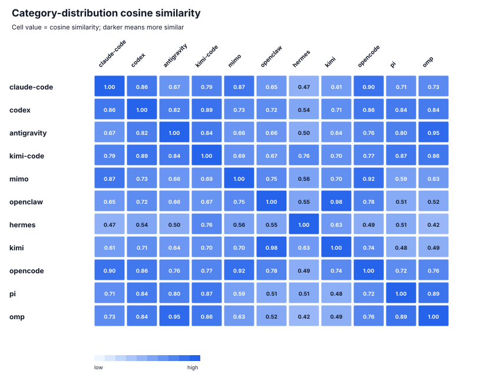

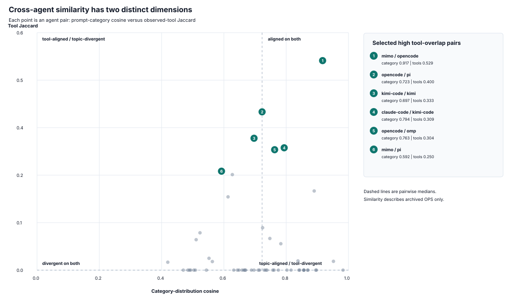

**双指标图读法：**每个点是一对 Agent，横轴是类别分布 cosine，纵轴是工具集合 Jaccard；虚线为所有 pair 的中位数。右下区域代表高层 prompt 主题相似但工具面重叠低，右上区域才是两个维度都较接近。右侧编号只标注工具重叠最高的若干 pair，避免 55 个标签互相遮挡。

解读建议：类别相似但工具 Jaccard 低，通常表示高层 prompt 功能趋同但具体 capability surface 不同；工具 Jaccard 高但类别相似低，则可能是共享底层工具形态但交互/治理文本不同。不要从相似度直接推断代码共享或抄袭。

<a id="section-6"></a>
## 6. 可直接写进技术报告的方法段

1. 定义 OPS：agent、version、capture profile 下的一次 prompt-bearing request。
2. 按 instruction plane、capability/tool plane、runtime plane、capture artifact 拆分。
3. 对每个 plane 分别 hash 并构造 prompt epochs，避免把无 prompt 变化的软件 release 重复计权。
4. 对 instruction/runtime 文本切 clause，用规则 taxonomy 做第一版分类，uncertain 项保留。
5. 用 macro-average 和 per-agent summary 做横向比较，避免 release 数多的 agent 主导结论。
6. 所有 claims 必须引用 `results/claims.csv`、派生表或图，不从一次性主观阅读得出。

<a id="section-7"></a>
## 7. 仍需加强的地方

- 对 `uncertain` 和 top churn 事件做人工抽样复核，形成分类准确率或审计说明。
- 若要用外部模型分类，需要显式批准把 selected prompt clauses 发送到该 endpoint，并保留 `classification_cache.jsonl`。
- 做更强的 clause alignment：当前 moved clause 检测基于 hash/source order，尚未做高质量语义 lineage。
- 对每个 top case study 增加短 excerpt，注意版权和引用长度。
- 如果论文要讨论 capture sensitivity，需要另开实验，不应从现有 archive 直接推断。

<a id="section-8"></a>
## 8. 复现入口和证据文件

```bash
python3 analysis_result/src/run_all.py
PHISTORY_ANALYSIS_USE_MODEL=1 PHISTORY_ANALYSIS_MODEL_LIMIT=200 python3 analysis_result/src/run_all.py
```

核心证据文件：`data/derived/snapshots.csv`、`data/derived/clauses.csv`、`data/derived/change_events.csv`、`results/trend_summary.csv`、`results/category_summary.csv`、`results/similarity_pairs.csv`、`results/claims.csv`。
