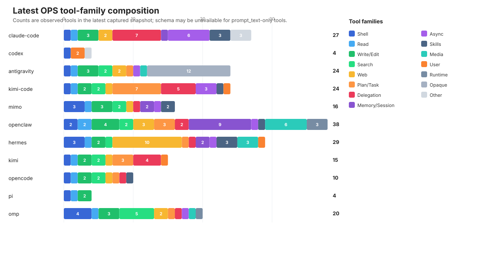
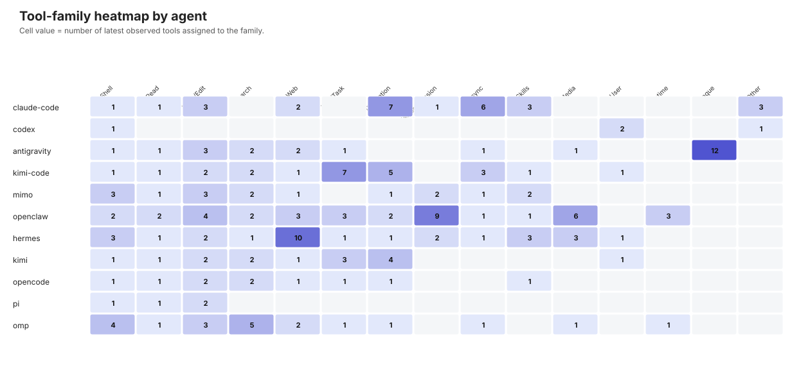
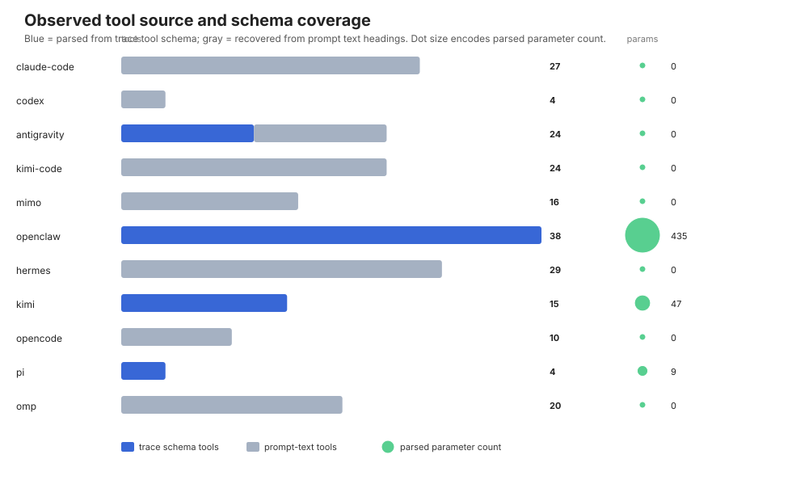
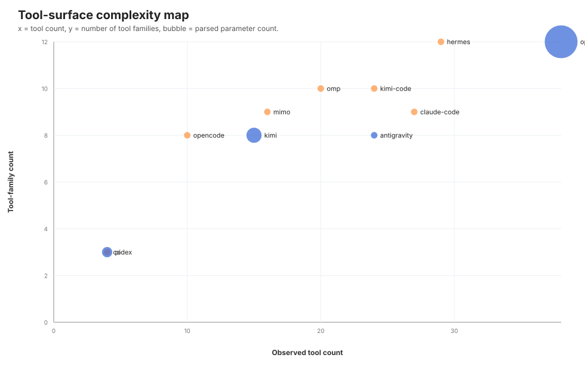
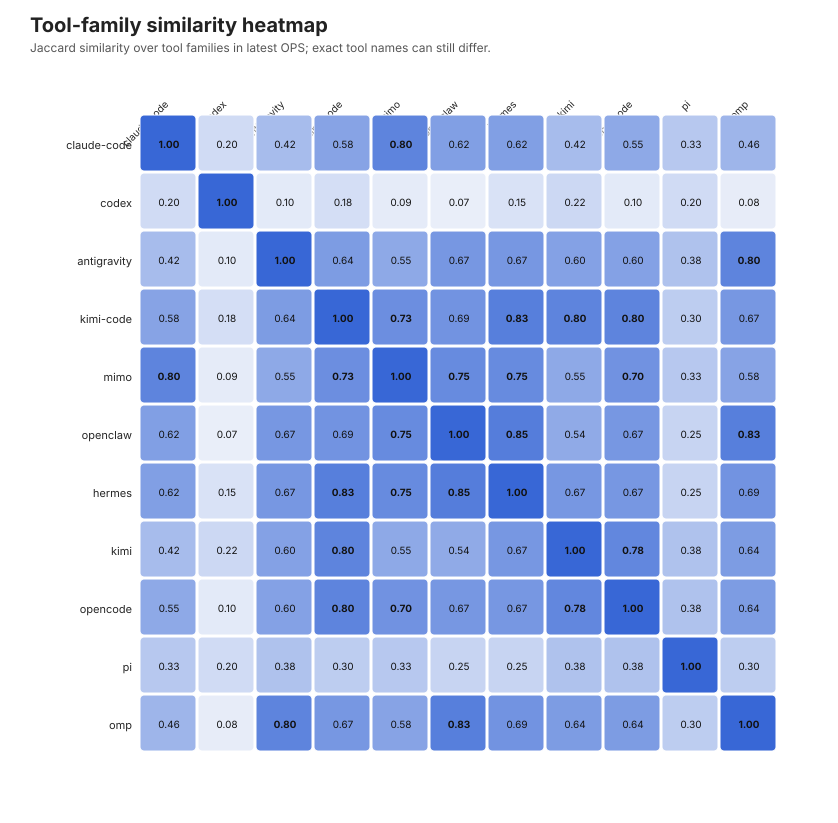

# Agent CLI Tool Surface Analysis

本文件回答：不同 Agent CLI 在当前 archive 最新快照中暴露的 tool surface 有什么区别。分析对象仍是 OPS，即特定 capture profile 下的观测工具声明或 prompt 工具标题，不等同于完整 harness 或真实运行时能力。

## 方法和限制

工具来源优先使用 `trace.jsonl` 中可解析的 tool schema；如果 trace body 不能统一解析，则用 `prompt.md` 的 Tools section 标题补充工具名。因此 `parameter_count=0` 常常表示 schema 未解析，不一定表示工具没有参数。Antigravity 最新快照同时出现 `tool_0` 这类匿名 trace alias 和人类可读工具标题，可能高估 user-facing distinct tool 数。

工具族 taxonomy：Shell/process; File read; File write/edit; Search/discovery; Web/browser; Planning/task state; Delegation/multi-agent; Memory/session; Scheduled/async; Skills/extensibility; Media/multimodal; User interaction; Runtime/integration; Opaque trace alias; Other。分类主要基于工具名，适合结构比较和 case selection，不适合当作实现级证明。

## 图形摘要

### 工具族组成

这张图把每个 agent 最新 OPS 中的工具按工具族堆叠。它直观显示：OpenClaw、Hermes、Claude Code、Kimi Code 的工具面更宽；Pi 和 Codex 最新 OPS 明显更小；Antigravity 的 `Opaque` 段表示 `tool_0` 这类匿名 trace alias，不能直接当成独立用户可见工具解释。

### Agent × 工具族热力图

热力图更适合看“某类工具是否集中在某些 agent”。例如 Hermes 的 browser family 很突出；OpenClaw 的 memory/session、media/multimodal 和 runtime integration 更突出；Kimi Code 的 planning/task state 和 delegation 更突出。

### 工具来源和 schema 覆盖

这张图区分工具来自 raw trace schema 还是从 prompt text 标题恢复。只有 OpenClaw、Kimi、Pi 等最新快照有较完整的 trace/schema 参数信息；很多 agent 的 `Params=0` 是因为 schema 未解析，不表示工具真实没有参数。

### 工具面复杂度散点图

横轴是工具数量，纵轴是工具族数量，气泡大小表示可解析参数数量。OpenClaw 同时在工具数量、工具族宽度和参数复杂度上都很高；Pi 和 Codex 位于低工具数区域，但原因不同：Pi 是最小文件/shell 工具闭包，Codex 是少数高层入口封装。

### 工具族相似度热力图

这张图用工具族 Jaccard 比较不同 agent。高相似不代表工具名完全相同，而是高层能力类型相似；例如 OpenClaw/Hermes 在 web、media、memory/session、async 等族上重叠较多，但 exact tool name Jaccard 仍然低。

## 最新快照工具画像

| Agent | Version | Tools | Trace/Prompt | Opaque aliases | Params | Families | Dominant families | Note |
| --- | --- | ---: | --- | ---: | ---: | ---: | --- | --- |
| claude-code | 2.1.209 | 27 | 0/27 | 0 | 0 | 9 | Delegation/multi-agent 7; Scheduled/async 6; Skills/extensibility 3; File write/edit 3; Other 3 | broad OS-like surface; stateful orchestration; schema mostly unavailable in latest trace |
| codex | 0.144.4 | 4 | 0/4 | 0 | 0 | 3 | User interaction 2; Shell/process 1; Other 1 | minimal core surface; schema mostly unavailable in latest trace |
| antigravity | 1.1.2 | 24 | 12/12 | 12 | 0 | 8 | Opaque trace alias 12; File write/edit 3; Search/discovery 2; Web/browser 2; Media/multimodal 1 | web/media capable; contains opaque trace aliases; count may overestimate user-facing tools |
| kimi-code | 0.24.1 | 24 | 0/24 | 0 | 0 | 10 | Planning/task state 7; Delegation/multi-agent 5; Scheduled/async 3; File write/edit 2; Search/discovery 2 | stateful orchestration; schema mostly unavailable in latest trace |
| mimo | 0.1.5 | 16 | 0/16 | 0 | 0 | 9 | Shell/process 3; File write/edit 3; Search/discovery 2; Memory/session 2; Skills/extensibility 2 | stateful orchestration; schema mostly unavailable in latest trace |
| openclaw | 2026.7.1 | 38 | 38/0 | 0 | 435 | 12 | Memory/session 9; Media/multimodal 6; File write/edit 4; Web/browser 3; Planning/task state 3 | broad OS-like surface; stateful orchestration; web/media capable |
| hermes | v2026.7.7.2 | 29 | 0/29 | 0 | 0 | 12 | Web/browser 10; Shell/process 3; Media/multimodal 3; Skills/extensibility 3; Memory/session 2 | broad OS-like surface; stateful orchestration; web/media capable; schema mostly unavailable in latest trace |
| kimi | 1.48.0 | 15 | 15/0 | 0 | 47 | 8 | Delegation/multi-agent 4; Planning/task state 3; Search/discovery 2; File write/edit 2; User interaction 1 |  |
| opencode | 1.17.20 | 10 | 0/10 | 0 | 0 | 8 | File write/edit 2; Search/discovery 2; Shell/process 1; File read 1; Skills/extensibility 1 | schema mostly unavailable in latest trace |
| pi | 0.80.6 | 4 | 4/0 | 0 | 9 | 3 | File write/edit 2; Shell/process 1; File read 1 | minimal core surface |
| omp | 16.5.0 | 20 | 0/20 | 0 | 0 | 10 | Search/discovery 5; Shell/process 4; File write/edit 3; Web/browser 2; Media/multimodal 1 | stateful orchestration; web/media capable; schema mostly unavailable in latest trace |

## 逐 Agent 解读

- **claude-code `2.1.209`**：Claude Code 最新 OPS 是工具编排很强的 surface：除 Bash/Read/Edit/Write/WebFetch/WebSearch 外，还有 TaskCreate/TaskOutput/TaskStop 等任务工具、Cron/Monitor/PushNotification/ScheduleWakeup 等异步工具、Skill/Workflow/DesignSync 等扩展入口。它不像最小 coding shell，而更像带后台任务、计划唤醒和技能系统的 agent 控制面。 代表工具：Agent, Bash, CronCreate, CronDelete, CronList, DesignSync, Edit, EnterWorktree, ExitWorktree, Monitor, NotebookEdit, PushNotification, Read, ReportFindings, ScheduleWakeup, SendMessage, Skill, TaskCreate ...。
- **codex `0.144.4`**：Codex 最新快照只暴露 4 个高层工具入口：exec、wait、request_user_input、collaboration。它的工具面更像把具体 shell/文件/补丁能力包进少数 developer tools，而不是在 OPS 里列出大量细粒度文件工具。由于该快照 trace body 为 missing_body，schema 细节不能从统一 trace 表中恢复。 代表工具：collaboration, exec, request_user_input, wait。
- **antigravity `1.1.2`**：Antigravity 同时有 run_command、view_file、write_to_file、replace_file_content、grep_search、list_dir、search_web、read_url_content、generate_image、schedule、manage_task 等可读工具名，也有 tool_0 到 tool_11 这类匿名 alias。因此它表现为 IDE/coding 基础工具加 web/image/schedule/task 管理，但 distinct tool count 需要保守看待。 代表工具：generate_image, grep_search, list_dir, manage_task, multi_replace_file_content, read_url_content, replace_file_content, run_command, schedule, search_web, tool_0, tool_1, tool_10, tool_11, tool_2, tool_3, tool_4, tool_5 ...。
- **kimi-code `0.24.1`**：Kimi Code 的工具面接近 Claude Code 的形态：Bash/Read/Edit/Write/Grep/Glob 是基础 coding 工具，Agent/AgentSwarm 和 TaskList/TaskOutput/TaskStop 表示多 agent 或后台任务，Cron 系列、Goal 系列、PlanMode 和 Skill 说明它有明显的任务生命周期和扩展机制。 代表工具：Agent, AgentSwarm, AskUserQuestion, Bash, CreateGoal, CronCreate, CronDelete, CronList, Edit, EnterPlanMode, ExitPlanMode, FetchURL, GetGoal, Glob, Grep, Read, SetGoalBudget, Skill ...。
- **mimo `0.1.5`**：MiMo 是中等规模、命名紧凑的工具面：bash/read/write/edit/glob/grep/webfetch 是基础 coding set，cron/history/memory/workflow/skill/task 体现状态、记忆、计划和扩展。它和 opencode 在工具名层面最接近，但 MiMo 额外强调 memory/history/workflow/cron。 代表工具：actor, bash, change_directory, cron, edit, glob, grep, history, memory, notebook_edit, read, skill, task, webfetch, workflow, write。
- **openclaw `2026.7.1`**：OpenClaw 最新 OPS 工具最多，并且 trace schema 可解析度最高。它覆盖 exec/apply_patch/read/write/edit、目录/文件 fetch/list/write、browser/web、memory、goal、sessions、subagents、cron、skill_workshop，以及 image/video/tts/pdf/canvas/node/gateway 等多模态和运行时集成能力，是最接近 OS-like agent surface 的一个。 代表工具：agents_list, apply_patch, browser, canvas, create_goal, cron, dir_fetch, dir_list, edit, exec, file_fetch, file_write, gateway, get_goal, image, image_generate, memory_get, memory_search ...。
- **hermes `v2026.7.7.2`**：Hermes 的工具面突出 browser automation：browser_click/type/press/scroll/snapshot/navigate/back/console/images/vision 构成细粒度浏览器控制；同时有 terminal/process/patch/read_file/write_file/search_files、delegate_task、todo、memory/session_search、skill_manage/skill_view/skills_list 和 image/vision/tts。它更像浏览器/多模态增强的 agent surface。 代表工具：browser_back, browser_click, browser_console, browser_get_images, browser_navigate, browser_press, browser_scroll, browser_snapshot, browser_type, browser_vision, clarify, cronjob, delegate_task, execute_code, image_generate, memory, patch, process ...。
- **kimi `1.48.0`**：Kimi CLI 是相对经典的 coding agent set：Shell、ReadFile、WriteFile、StrReplaceFile、Glob、Grep、FetchURL，加上 Agent/AskUserQuestion/PlanMode/SetTodoList/TaskList/TaskOutput/TaskStop。它有可解析 schema，工具数量中等，偏向文件修改、搜索、shell 和任务状态。 代表工具：Agent, AskUserQuestion, EnterPlanMode, ExitPlanMode, FetchURL, Glob, Grep, ReadFile, SetTodoList, Shell, StrReplaceFile, TaskList, TaskOutput, TaskStop, WriteFile。
- **opencode `1.17.20`**：opencode 最新工具面很精简：bash/read/write/edit/glob/grep/webfetch/task/todowrite/skill。它和 MiMo 的 exact normalized tool overlap 最高，属于经典 coding toolkit 加 task/todo/skill/web 的简洁形态。 代表工具：bash, edit, glob, grep, read, skill, task, todowrite, webfetch, write。
- **pi `0.80.6`**：Pi 是最小工具面，只包含 bash/read/write/edit 四件套，并且有可解析参数 schema。它适合当作最小 coding-agent OPS 对照：没有 web、搜索、todo、memory、skill、多 agent 或异步工具暴露。 代表工具：bash, edit, read, write。
- **omp `16.5.0`**：OMP 比 Pi 大得多，除 bash/read/write/edit/glob/grep/task/todo/web_search 外，还有 ast_edit/ast_grep/lsp/resolve/debug/eval/launch/job/browser/generate_image/irc。它更像带 AST/LSP/debug/runtime job 的工程工具面。 代表工具：ast_edit, ast_grep, bash, browser, debug, edit, eval, generate_image, glob, grep, irc, job, launch, lsp, read, resolve, task, todo ...。

## 跨 Agent 对比模式

- **最小核心型**：Pi 只暴露 bash/read/write/edit，是文件编辑 + shell 的最小闭包。
- **经典 coding toolkit 型**：opencode、MiMo、Kimi CLI 以 shell、read/write/edit、glob/grep、webfetch、todo/task 为主。
- **编排/状态增强型**：Claude Code、Kimi Code、OpenClaw 引入 goal、task、cron、monitor、subagent/session/skill 等机制，工具面更像长期任务控制面。
- **浏览器/多模态增强型**：Hermes、OpenClaw、OMP、Antigravity 暴露 browser、image、vision、tts/video/pdf/canvas 等能力，已经超出传统代码编辑工具。
- **高层入口封装型**：Codex 最新 OPS 只显示 exec/wait/request_user_input/collaboration 等少数高层工具，具体实现细节不在工具名层面展开。

## 工具族相似度 Top 10

| Pair | Family Jaccard | Exact-name Jaccard | Shared families | Shared exact tools |
| --- | ---: | ---: | --- | --- |
| openclaw / hermes | 0.846 | 0.031 | Shell/process; File read; File write/edit; Search/discovery; Web/browser; Planning/task state; Delegation/multi-agent; Memory/session; Scheduled/async; Skills/extensibility; Media/multimodal | image_generate; process |
| openclaw / omp | 0.833 | 0.094 | Shell/process; File read; File write/edit; Search/discovery; Web/browser; Planning/task state; Delegation/multi-agent; Scheduled/async; Media/multimodal; Runtime/integration | browser; edit; read; web_search; write |
| kimi-code / hermes | 0.833 | 0.000 | Shell/process; File read; File write/edit; Search/discovery; Web/browser; Planning/task state; Delegation/multi-agent; Scheduled/async; Skills/extensibility; User interaction |  |
| kimi-code / kimi | 0.800 | 0.345 | Shell/process; File read; File write/edit; Search/discovery; Web/browser; Planning/task state; Delegation/multi-agent; User interaction | agent; askuserquestion; enterplanmode; exitplanmode; fetchurl; glob; grep; tasklist; taskoutput; taskstop |
| kimi-code / opencode | 0.800 | 0.259 | Shell/process; File read; File write/edit; Search/discovery; Web/browser; Planning/task state; Delegation/multi-agent; Skills/extensibility | bash; edit; glob; grep; read; skill; write |
| claude-code / mimo | 0.800 | 0.194 | Shell/process; File read; File write/edit; Web/browser; Delegation/multi-agent; Memory/session; Scheduled/async; Skills/extensibility | bash; edit; read; skill; webfetch; workflow; write |
| antigravity / omp | 0.800 | 0.032 | Shell/process; File read; File write/edit; Search/discovery; Web/browser; Planning/task state; Scheduled/async; Media/multimodal | generate_image |
| kimi / opencode | 0.778 | 0.087 | Shell/process; File read; File write/edit; Search/discovery; Web/browser; Planning/task state; Delegation/multi-agent | glob; grep |
| mimo / openclaw | 0.750 | 0.080 | Shell/process; File read; File write/edit; Search/discovery; Web/browser; Delegation/multi-agent; Memory/session; Scheduled/async; Skills/extensibility | cron; edit; read; write |
| mimo / hermes | 0.750 | 0.023 | Shell/process; File read; File write/edit; Search/discovery; Web/browser; Delegation/multi-agent; Memory/session; Scheduled/async; Skills/extensibility | memory |

结论：如果按工具族看，很多 agent 都覆盖 shell、文件读写、搜索、web、task/state 等高层能力，存在功能层面的收敛；如果按 exact tool name 看，只有 MiMo/opencode、Pi/OMP 等少数 pair 有较高重叠，多数 agent 仍然在命名、粒度、权限模型和 orchestration 方式上分化明显。
